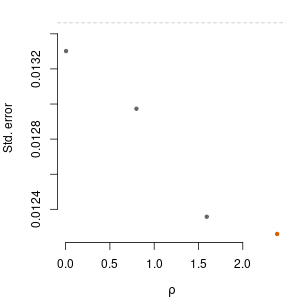
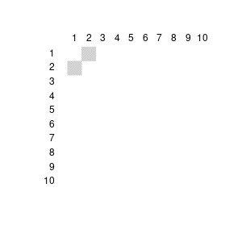

<!-- README.md is generated from README.Rmd. Please edit that file -->

```{r, include = FALSE}
knitr::opts_chunk$set(
  collapse = TRUE,
  comment = "#>",
  fig.path = "man/figures/README-",
  out.width = "100%"
)
```

# geneJAM

<!-- badges: start -->
<!-- badges: end -->

The goal of geneJAM is to help clustering outcome components (traits) that share some feature (genetic component) using polygenic risk scores (PRS).

## Installation

You can install the development version from [GitHub](https://github.com/) with:

``` r
# install.packages("devtools")
devtools::install_github("abuchardt/geneJAM")
```
## Example

This is a basic example on simulated data:

```{r example}
library(geneJAM)
N <- 1000 #
q <- 10 #
p <- 5000 #
set.seed(1)
# Sample 1
X0 <- matrix(rbinom(n = N*p, size = 2, prob = 0.3), nrow=N, ncol=p)
B <- matrix(0, nrow = p, ncol = q)
B[1, 1:2] <- 1
B[3, 3] <- 2
Y0 <- X0 %*% B + matrix(rnorm(N*q), nrow = N, ncol = q)
```

Compute polygenic scores and coefficients
```{r ps}
psobj <- ps.geneJAM(X0, Y0)
ps <- psobj$PS
beta <- psobj$beta
```

Create new sample
```{r sample2}
X <- matrix(rbinom(n = N*p, size = 2, prob = 0.3), nrow=N, ncol=p)
Y <- X %*% B + matrix(rnorm(N*q), nrow = N, ncol = q)
PS <- X %*% beta
```

Run geneJAM
```{r step1}
fit <- geneJAM(PS, Y)
```

Plot mean standard error curve
```{r p1, eval=FALSE}
plot(fit, 1)
```

```{r p1save, include=FALSE}
png("/home/ann-sophie/wip/R/geneJAM/README-plot1.png",
    width = 300, height = 300)
par(mar = c(4,4,1,1))
plot(fit, 1)
dev.off()
```




Plot estimated optimal adjacency matrix
```{r p2, eval=FALSE}
plot(fit, 2)
```

```{r p2save, include=FALSE}
png("/home/ann-sophie/wip/R/geneJAM/README-plot2.png",
    width = 300, height = 300)
par(mar = c(4,4,1,1))
plot(fit, 2)
dev.off()
```



