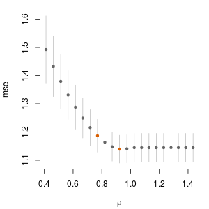

<!-- README.md is generated from README.Rmd. Please edit that file -->
EdGwas
======

<!-- badges: start -->
<!-- badges: end -->
The goal of EdGwas is to help clustering outcome components (traits) that share some feature (genetic component) using polygenic risk scores (PRS).

Installation
------------

You can install the development version from [GitHub](https://github.com/) with:

``` r
# install.packages("devtools")
devtools::install_github("abuchardt/EdGwas")
```

Example
-------

This is a basic example on simulated data:

``` r
library(EdGwas)
#> Registered S3 methods overwritten by 'ggplot2':
#>   method         from 
#>   [.quosures     rlang
#>   c.quosures     rlang
#>   print.quosures rlang
N <- 1000 
q <- 10
p <- 100
set.seed(1)
x <- matrix(sample(0:2, N*p, replace=TRUE), nrow=N, ncol=p)
B <- matrix(0, nrow = p, ncol = q)
B[1, 1:2] <- 5
y <- x %*% B + matrix(rnorm(N*q), nrow = N, ncol = q)
```

Compute polygenic scores

``` r
ps <- ps.edgwas(x, y)$PS
```

Run 10-fold cross-validation for edgwas

``` r
pc <- cv.edgwas(ps, y)
```

Plot cross-validated error curve

``` r
plot(pc, 1)
```


Zoom

``` r
plot(pc, 1, zoom = 10)
```



Plot estimated optimal adjacency matrix

``` r
plot(pc, 2)
```


