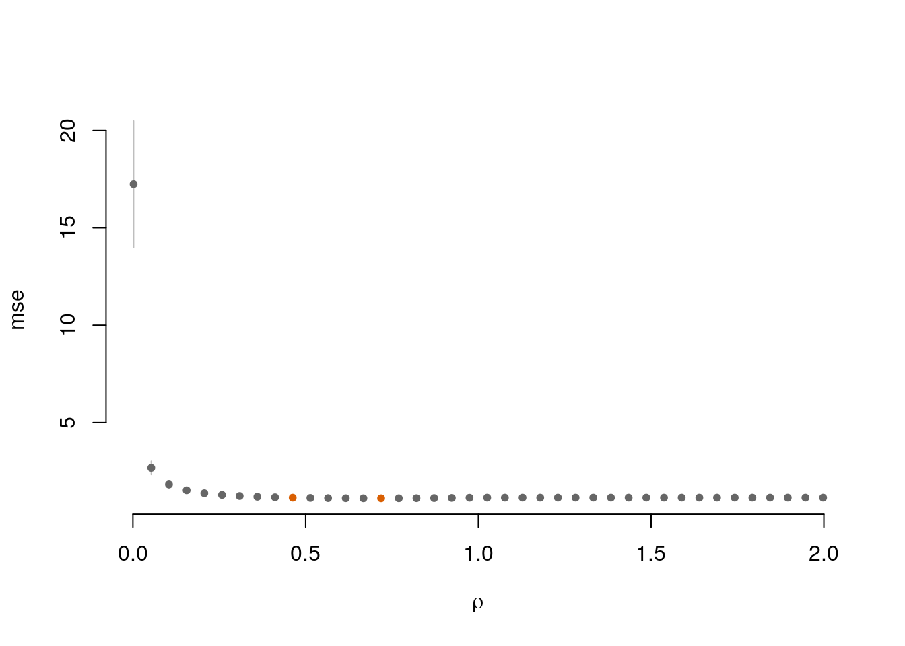

<!-- README.md is generated from README.Rmd. Please edit that file -->


# EdGwas

<!-- badges: start -->
<!-- badges: end -->

The goal of EdGwas is to help clustering outcome components (traits) that share some feature (genetic component) using polygenic risk scores (PRS).

## Installation

You can install the development version from [GitHub](https://github.com/) with:

``` r
# install.packages("devtools")
devtools::install_github("abuchardt/EdGwas")
```
## Example

This is a basic example on simulated data:


```r
library(EdGwas)
# Gaussian
N <- 100 #
q <- 9
p <- 1000 #
set.seed(1)
X <- matrix(sample(0:2, N*p, replace=TRUE), nrow=N, ncol=p)
B <- matrix(0, nrow = p, ncol = q)
B[1:2, 1:5] <- 1
Y <- X %*% B + matrix(rnorm(N*q), nrow = N, ncol = q)
```

Run 5-fold cross-validation for edgwas

```r
cvfit <- cv.edgwas(x = X, y = Y, nfolds = 5)
```


```r
plot(cvfit, which = 1)
```




```r
plot(cvfit, which = 3) 
```

<!--html_preserve--><div id="htmlwidget-a0bbaf6034968c7c4a77" style="width:100%;height:480px;" class="plotly html-widget"></div>
<script type="application/json" data-for="htmlwidget-a0bbaf6034968c7c4a77">{"x":{"data":[{"x":[1,2,3,4,5,6,7,8,9],"y":[1,2,3,4,5,6,7,8,9],"z":[[0,1,1,1,1,1,1,1,0],[1,0,1,1,1,1,1,1,1],[1,1,0,1,1,1,1,1,1],[1,1,1,0,1,1,1,1,1],[1,1,1,1,0,1,1,1,1],[1,1,1,1,1,0,1,1,1],[1,1,1,1,1,1,0,1,1],[1,1,1,1,1,1,1,0,1],[0,1,1,1,1,1,1,1,0]],"text":[["value: 0<br />Var1: V1<br />Var2: V1<br />rho: 0.002512489","value: 1<br />Var1: V2<br />Var2: V1<br />rho: 0.002512489","value: 1<br />Var1: V3<br />Var2: V1<br />rho: 0.002512489","value: 1<br />Var1: V4<br />Var2: V1<br />rho: 0.002512489","value: 1<br />Var1: V5<br />Var2: V1<br />rho: 0.002512489","value: 1<br />Var1: V6<br />Var2: V1<br />rho: 0.002512489","value: 1<br />Var1: V7<br />Var2: V1<br />rho: 0.002512489","value: 1<br />Var1: V8<br />Var2: V1<br />rho: 0.002512489","value: 0<br />Var1: V9<br />Var2: V1<br />rho: 0.002512489"],["value: 1<br />Var1: V1<br />Var2: V2<br />rho: 0.002512489","value: 0<br />Var1: V2<br />Var2: V2<br />rho: 0.002512489","value: 1<br />Var1: V3<br />Var2: V2<br />rho: 0.002512489","value: 1<br />Var1: V4<br />Var2: V2<br />rho: 0.002512489","value: 1<br />Var1: V5<br />Var2: V2<br />rho: 0.002512489","value: 1<br />Var1: V6<br />Var2: V2<br />rho: 0.002512489","value: 1<br />Var1: V7<br />Var2: V2<br />rho: 0.002512489","value: 1<br />Var1: V8<br />Var2: V2<br />rho: 0.002512489","value: 1<br />Var1: V9<br />Var2: V2<br />rho: 0.002512489"],["value: 1<br />Var1: V1<br />Var2: V3<br />rho: 0.002512489","value: 1<br />Var1: V2<br />Var2: V3<br />rho: 0.002512489","value: 0<br />Var1: V3<br />Var2: V3<br />rho: 0.002512489","value: 1<br />Var1: V4<br />Var2: V3<br />rho: 0.002512489","value: 1<br />Var1: V5<br />Var2: V3<br />rho: 0.002512489","value: 1<br />Var1: V6<br />Var2: V3<br />rho: 0.002512489","value: 1<br />Var1: V7<br />Var2: V3<br />rho: 0.002512489","value: 1<br />Var1: V8<br />Var2: V3<br />rho: 0.002512489","value: 1<br />Var1: V9<br />Var2: V3<br />rho: 0.002512489"],["value: 1<br />Var1: V1<br />Var2: V4<br />rho: 0.002512489","value: 1<br />Var1: V2<br />Var2: V4<br />rho: 0.002512489","value: 1<br />Var1: V3<br />Var2: V4<br />rho: 0.002512489","value: 0<br />Var1: V4<br />Var2: V4<br />rho: 0.002512489","value: 1<br />Var1: V5<br />Var2: V4<br />rho: 0.002512489","value: 1<br />Var1: V6<br />Var2: V4<br />rho: 0.002512489","value: 1<br />Var1: V7<br />Var2: V4<br />rho: 0.002512489","value: 1<br />Var1: V8<br />Var2: V4<br />rho: 0.002512489","value: 1<br />Var1: V9<br />Var2: V4<br />rho: 0.002512489"],["value: 1<br />Var1: V1<br />Var2: V5<br />rho: 0.002512489","value: 1<br />Var1: V2<br />Var2: V5<br />rho: 0.002512489","value: 1<br />Var1: V3<br />Var2: V5<br />rho: 0.002512489","value: 1<br />Var1: V4<br />Var2: V5<br />rho: 0.002512489","value: 0<br />Var1: V5<br />Var2: V5<br />rho: 0.002512489","value: 1<br />Var1: V6<br />Var2: V5<br />rho: 0.002512489","value: 1<br />Var1: V7<br />Var2: V5<br />rho: 0.002512489","value: 1<br />Var1: V8<br />Var2: V5<br />rho: 0.002512489","value: 1<br />Var1: V9<br />Var2: V5<br />rho: 0.002512489"],["value: 1<br />Var1: V1<br />Var2: V6<br />rho: 0.002512489","value: 1<br />Var1: V2<br />Var2: V6<br />rho: 0.002512489","value: 1<br />Var1: V3<br />Var2: V6<br />rho: 0.002512489","value: 1<br />Var1: V4<br />Var2: V6<br />rho: 0.002512489","value: 1<br />Var1: V5<br />Var2: V6<br />rho: 0.002512489","value: 0<br />Var1: V6<br />Var2: V6<br />rho: 0.002512489","value: 1<br />Var1: V7<br />Var2: V6<br />rho: 0.002512489","value: 1<br />Var1: V8<br />Var2: V6<br />rho: 0.002512489","value: 1<br />Var1: V9<br />Var2: V6<br />rho: 0.002512489"],["value: 1<br />Var1: V1<br />Var2: V7<br />rho: 0.002512489","value: 1<br />Var1: V2<br />Var2: V7<br />rho: 0.002512489","value: 1<br />Var1: V3<br />Var2: V7<br />rho: 0.002512489","value: 1<br />Var1: V4<br />Var2: V7<br />rho: 0.002512489","value: 1<br />Var1: V5<br />Var2: V7<br />rho: 0.002512489","value: 1<br />Var1: V6<br />Var2: V7<br />rho: 0.002512489","value: 0<br />Var1: V7<br />Var2: V7<br />rho: 0.002512489","value: 1<br />Var1: V8<br />Var2: V7<br />rho: 0.002512489","value: 1<br />Var1: V9<br />Var2: V7<br />rho: 0.002512489"],["value: 1<br />Var1: V1<br />Var2: V8<br />rho: 0.002512489","value: 1<br />Var1: V2<br />Var2: V8<br />rho: 0.002512489","value: 1<br />Var1: V3<br />Var2: V8<br />rho: 0.002512489","value: 1<br />Var1: V4<br />Var2: V8<br />rho: 0.002512489","value: 1<br />Var1: V5<br />Var2: V8<br />rho: 0.002512489","value: 1<br />Var1: V6<br />Var2: V8<br />rho: 0.002512489","value: 1<br />Var1: V7<br />Var2: V8<br />rho: 0.002512489","value: 0<br />Var1: V8<br />Var2: V8<br />rho: 0.002512489","value: 1<br />Var1: V9<br />Var2: V8<br />rho: 0.002512489"],["value: 0<br />Var1: V1<br />Var2: V9<br />rho: 0.002512489","value: 1<br />Var1: V2<br />Var2: V9<br />rho: 0.002512489","value: 1<br />Var1: V3<br />Var2: V9<br />rho: 0.002512489","value: 1<br />Var1: V4<br />Var2: V9<br />rho: 0.002512489","value: 1<br />Var1: V5<br />Var2: V9<br />rho: 0.002512489","value: 1<br />Var1: V6<br />Var2: V9<br />rho: 0.002512489","value: 1<br />Var1: V7<br />Var2: V9<br />rho: 0.002512489","value: 1<br />Var1: V8<br />Var2: V9<br />rho: 0.002512489","value: 0<br />Var1: V9<br />Var2: V9<br />rho: 0.002512489"]],"frame":"0.0025124893","colorscale":[[0,"#FFFFFF"],[1,"#16161D"]],"type":"heatmap","showscale":false,"autocolorscale":false,"showlegend":false,"xaxis":"x","yaxis":"y","hoverinfo":"text","visible":true},{"x":[1.5,1.5,null,2.5,2.5,null,3.5,3.5,null,4.5,4.5,null,5.5,5.5,null,6.5,6.5,null,7.5,7.5,null,8.5,8.5,null,9.5,9.5],"y":[0.4,9.6,null,0.4,9.6,null,0.4,9.6,null,0.4,9.6,null,0.4,9.6,null,0.4,9.6,null,0.4,9.6,null,0.4,9.6,null,0.4,9.6],"text":["xintercept: 1.5","xintercept: 1.5",null,"xintercept: 2.5","xintercept: 2.5",null,"xintercept: 3.5","xintercept: 3.5",null,"xintercept: 4.5","xintercept: 4.5",null,"xintercept: 5.5","xintercept: 5.5",null,"xintercept: 6.5","xintercept: 6.5",null,"xintercept: 7.5","xintercept: 7.5",null,"xintercept: 8.5","xintercept: 8.5",null,"xintercept: 9.5","xintercept: 9.5"],"type":"scatter","mode":"lines","line":{"width":1.88976377952756,"color":"rgba(255,255,255,1)","dash":"solid"},"hoveron":"points","showlegend":false,"xaxis":"x","yaxis":"y","hoverinfo":"text","frame":null},{"x":[0.4,9.6,null,0.4,9.6,null,0.4,9.6,null,0.4,9.6,null,0.4,9.6,null,0.4,9.6,null,0.4,9.6,null,0.4,9.6,null,0.4,9.6],"y":[1.5,1.5,null,2.5,2.5,null,3.5,3.5,null,4.5,4.5,null,5.5,5.5,null,6.5,6.5,null,7.5,7.5,null,8.5,8.5,null,9.5,9.5],"text":["yintercept: 1.5","yintercept: 1.5",null,"yintercept: 2.5","yintercept: 2.5",null,"yintercept: 3.5","yintercept: 3.5",null,"yintercept: 4.5","yintercept: 4.5",null,"yintercept: 5.5","yintercept: 5.5",null,"yintercept: 6.5","yintercept: 6.5",null,"yintercept: 7.5","yintercept: 7.5",null,"yintercept: 8.5","yintercept: 8.5",null,"yintercept: 9.5","yintercept: 9.5"],"type":"scatter","mode":"lines","line":{"width":1.88976377952756,"color":"rgba(255,255,255,1)","dash":"solid"},"hoveron":"points","showlegend":false,"xaxis":"x","yaxis":"y","hoverinfo":"text","frame":null}],"layout":{"margin":{"t":26.2283105022831,"r":7.30593607305936,"b":25.5707762557078,"l":22.648401826484},"paper_bgcolor":"rgba(255,255,255,1)","font":{"color":"rgba(0,0,0,1)","family":"","size":14.6118721461187},"xaxis":{"domain":[0,1],"automargin":true,"type":"linear","autorange":false,"range":[0.4,9.6],"tickmode":"array","ticktext":["V1","V2","V3","V4","V5","V6","V7","V8","V9"],"tickvals":[1,2,3,4,5,6,7,8,9],"categoryorder":"array","categoryarray":["V1","V2","V3","V4","V5","V6","V7","V8","V9"],"nticks":null,"ticks":"","tickcolor":null,"ticklen":3.65296803652968,"tickwidth":0,"showticklabels":true,"tickfont":{"color":"rgba(77,77,77,1)","family":"","size":11.689497716895},"tickangle":-0,"showline":false,"linecolor":null,"linewidth":0,"showgrid":false,"gridcolor":null,"gridwidth":0,"zeroline":false,"anchor":"y","title":{"text":"","font":{"color":null,"family":null,"size":0}},"scaleanchor":"y","scaleratio":1,"hoverformat":".2f"},"yaxis":{"domain":[0,1],"automargin":true,"type":"linear","autorange":false,"range":[0.4,9.6],"tickmode":"array","ticktext":["V1","V2","V3","V4","V5","V6","V7","V8","V9"],"tickvals":[1,2,3,4,5,6,7,8,9],"categoryorder":"array","categoryarray":["V1","V2","V3","V4","V5","V6","V7","V8","V9"],"nticks":null,"ticks":"","tickcolor":null,"ticklen":3.65296803652968,"tickwidth":0,"showticklabels":true,"tickfont":{"color":"rgba(77,77,77,1)","family":"","size":11.689497716895},"tickangle":-0,"showline":false,"linecolor":null,"linewidth":0,"showgrid":false,"gridcolor":null,"gridwidth":0,"zeroline":false,"anchor":"x","title":{"text":"","font":{"color":null,"family":null,"size":0}},"scaleanchor":"x","scaleratio":1,"hoverformat":".2f"},"shapes":[{"type":"rect","fillcolor":null,"line":{"color":null,"width":0,"linetype":[]},"yref":"paper","xref":"paper","x0":0,"x1":1,"y0":0,"y1":1}],"showlegend":false,"legend":{"bgcolor":"rgba(255,255,255,1)","bordercolor":"transparent","borderwidth":1.88976377952756,"font":{"color":"rgba(0,0,0,1)","family":"","size":11.689497716895}},"hovermode":"closest","barmode":"relative","sliders":[{"currentvalue":{"prefix":"rho ","xanchor":"right","font":{"size":16,"color":"black"}},"steps":[{"method":"animate","args":[["0.002512489"],{"transition":{"duration":500,"easing":"linear"},"frame":{"duration":500,"redraw":true},"mode":"immediate"}],"label":"0.002512489","value":"0.002512489"},{"method":"animate","args":[["0.00361409"],{"transition":{"duration":500,"easing":"linear"},"frame":{"duration":500,"redraw":true},"mode":"immediate"}],"label":"0.00361409","value":"0.00361409"},{"method":"animate","args":[["0.005198687"],{"transition":{"duration":500,"easing":"linear"},"frame":{"duration":500,"redraw":true},"mode":"immediate"}],"label":"0.005198687","value":"0.005198687"},{"method":"animate","args":[["0.007478051"],{"transition":{"duration":500,"easing":"linear"},"frame":{"duration":500,"redraw":true},"mode":"immediate"}],"label":"0.007478051","value":"0.007478051"},{"method":"animate","args":[["0.0107568"],{"transition":{"duration":500,"easing":"linear"},"frame":{"duration":500,"redraw":true},"mode":"immediate"}],"label":"0.0107568","value":"0.0107568"},{"method":"animate","args":[["0.01547312"],{"transition":{"duration":500,"easing":"linear"},"frame":{"duration":500,"redraw":true},"mode":"immediate"}],"label":"0.01547312","value":"0.01547312"},{"method":"animate","args":[["0.02225731"],{"transition":{"duration":500,"easing":"linear"},"frame":{"duration":500,"redraw":true},"mode":"immediate"}],"label":"0.02225731","value":"0.02225731"},{"method":"animate","args":[["0.03201602"],{"transition":{"duration":500,"easing":"linear"},"frame":{"duration":500,"redraw":true},"mode":"immediate"}],"label":"0.03201602","value":"0.03201602"},{"method":"animate","args":[["0.04605344"],{"transition":{"duration":500,"easing":"linear"},"frame":{"duration":500,"redraw":true},"mode":"immediate"}],"label":"0.04605344","value":"0.04605344"},{"method":"animate","args":[["0.06624557"],{"transition":{"duration":500,"easing":"linear"},"frame":{"duration":500,"redraw":true},"mode":"immediate"}],"label":"0.06624557","value":"0.06624557"},{"method":"animate","args":[["0.09529094"],{"transition":{"duration":500,"easing":"linear"},"frame":{"duration":500,"redraw":true},"mode":"immediate"}],"label":"0.09529094","value":"0.09529094"},{"method":"animate","args":[["0.1370712"],{"transition":{"duration":500,"easing":"linear"},"frame":{"duration":500,"redraw":true},"mode":"immediate"}],"label":"0.1370712","value":"0.1370712"},{"method":"animate","args":[["0.1971701"],{"transition":{"duration":500,"easing":"linear"},"frame":{"duration":500,"redraw":true},"mode":"immediate"}],"label":"0.1971701","value":"0.1971701"},{"method":"animate","args":[["0.2836193"],{"transition":{"duration":500,"easing":"linear"},"frame":{"duration":500,"redraw":true},"mode":"immediate"}],"label":"0.2836193","value":"0.2836193"},{"method":"animate","args":[["0.4079722"],{"transition":{"duration":500,"easing":"linear"},"frame":{"duration":500,"redraw":true},"mode":"immediate"}],"label":"0.4079722","value":"0.4079722"},{"method":"animate","args":[["0.5868475"],{"transition":{"duration":500,"easing":"linear"},"frame":{"duration":500,"redraw":true},"mode":"immediate"}],"label":"0.5868475","value":"0.5868475"},{"method":"animate","args":[["0.8441508"],{"transition":{"duration":500,"easing":"linear"},"frame":{"duration":500,"redraw":true},"mode":"immediate"}],"label":"0.8441508","value":"0.8441508"},{"method":"animate","args":[["1.214269"],{"transition":{"duration":500,"easing":"linear"},"frame":{"duration":500,"redraw":true},"mode":"immediate"}],"label":"1.214269","value":"1.214269"},{"method":"animate","args":[["1.746664"],{"transition":{"duration":500,"easing":"linear"},"frame":{"duration":500,"redraw":true},"mode":"immediate"}],"label":"1.746664","value":"1.746664"},{"method":"animate","args":[["2.512489"],{"transition":{"duration":500,"easing":"linear"},"frame":{"duration":500,"redraw":true},"mode":"immediate"}],"label":"2.512489","value":"2.512489"}],"visible":true,"pad":{"t":40}}],"updatemenus":[{"type":"buttons","direction":"right","showactive":false,"y":0,"x":0,"yanchor":"top","xanchor":"right","pad":{"t":60,"r":5},"buttons":[{"label":"Play","method":"animate","args":[null,{"fromcurrent":true,"mode":"immediate","transition":{"duration":500,"easing":"linear"},"frame":{"duration":500,"redraw":true}}]}]}]},"config":{"doubleClick":"reset","showSendToCloud":false},"source":"A","attrs":{"499337155db0":{"fill":{},"x":{},"y":{},"frame":{},"type":"heatmap"},"49936d2cbb4":{"xintercept":{}},"49932bd3c6e5":{"yintercept":{}}},"cur_data":"499337155db0","visdat":{"499337155db0":["function (y) ","x"],"49936d2cbb4":["function (y) ","x"],"49932bd3c6e5":["function (y) ","x"]},"highlight":{"on":"plotly_click","persistent":false,"dynamic":false,"selectize":false,"opacityDim":0.2,"selected":{"opacity":1},"debounce":0},"frames":[{"name":"0.002512489","data":[{"x":[1,2,3,4,5,6,7,8,9],"y":[1,2,3,4,5,6,7,8,9],"z":[[0,1,1,1,1,1,1,1,0],[1,0,1,1,1,1,1,1,1],[1,1,0,1,1,1,1,1,1],[1,1,1,0,1,1,1,1,1],[1,1,1,1,0,1,1,1,1],[1,1,1,1,1,0,1,1,1],[1,1,1,1,1,1,0,1,1],[1,1,1,1,1,1,1,0,1],[0,1,1,1,1,1,1,1,0]],"text":[["value: 0<br />Var1: V1<br />Var2: V1<br />rho: 0.002512489","value: 1<br />Var1: V2<br />Var2: V1<br />rho: 0.002512489","value: 1<br />Var1: V3<br />Var2: V1<br />rho: 0.002512489","value: 1<br />Var1: V4<br />Var2: V1<br />rho: 0.002512489","value: 1<br />Var1: V5<br />Var2: V1<br />rho: 0.002512489","value: 1<br />Var1: V6<br />Var2: V1<br />rho: 0.002512489","value: 1<br />Var1: V7<br />Var2: V1<br />rho: 0.002512489","value: 1<br />Var1: V8<br />Var2: V1<br />rho: 0.002512489","value: 0<br />Var1: V9<br />Var2: V1<br />rho: 0.002512489"],["value: 1<br />Var1: V1<br />Var2: V2<br />rho: 0.002512489","value: 0<br />Var1: V2<br />Var2: V2<br />rho: 0.002512489","value: 1<br />Var1: V3<br />Var2: V2<br />rho: 0.002512489","value: 1<br />Var1: V4<br />Var2: V2<br />rho: 0.002512489","value: 1<br />Var1: V5<br />Var2: V2<br />rho: 0.002512489","value: 1<br />Var1: V6<br />Var2: V2<br />rho: 0.002512489","value: 1<br />Var1: V7<br />Var2: V2<br />rho: 0.002512489","value: 1<br />Var1: V8<br />Var2: V2<br />rho: 0.002512489","value: 1<br />Var1: V9<br />Var2: V2<br />rho: 0.002512489"],["value: 1<br />Var1: V1<br />Var2: V3<br />rho: 0.002512489","value: 1<br />Var1: V2<br />Var2: V3<br />rho: 0.002512489","value: 0<br />Var1: V3<br />Var2: V3<br />rho: 0.002512489","value: 1<br />Var1: V4<br />Var2: V3<br />rho: 0.002512489","value: 1<br />Var1: V5<br />Var2: V3<br />rho: 0.002512489","value: 1<br />Var1: V6<br />Var2: V3<br />rho: 0.002512489","value: 1<br />Var1: V7<br />Var2: V3<br />rho: 0.002512489","value: 1<br />Var1: V8<br />Var2: V3<br />rho: 0.002512489","value: 1<br />Var1: V9<br />Var2: V3<br />rho: 0.002512489"],["value: 1<br />Var1: V1<br />Var2: V4<br />rho: 0.002512489","value: 1<br />Var1: V2<br />Var2: V4<br />rho: 0.002512489","value: 1<br />Var1: V3<br />Var2: V4<br />rho: 0.002512489","value: 0<br />Var1: V4<br />Var2: V4<br />rho: 0.002512489","value: 1<br />Var1: V5<br />Var2: V4<br />rho: 0.002512489","value: 1<br />Var1: V6<br />Var2: V4<br />rho: 0.002512489","value: 1<br />Var1: V7<br />Var2: V4<br />rho: 0.002512489","value: 1<br />Var1: V8<br />Var2: V4<br />rho: 0.002512489","value: 1<br />Var1: V9<br />Var2: V4<br />rho: 0.002512489"],["value: 1<br />Var1: V1<br />Var2: V5<br />rho: 0.002512489","value: 1<br />Var1: V2<br />Var2: V5<br />rho: 0.002512489","value: 1<br />Var1: V3<br />Var2: V5<br />rho: 0.002512489","value: 1<br />Var1: V4<br />Var2: V5<br />rho: 0.002512489","value: 0<br />Var1: V5<br />Var2: V5<br />rho: 0.002512489","value: 1<br />Var1: V6<br />Var2: V5<br />rho: 0.002512489","value: 1<br />Var1: V7<br />Var2: V5<br />rho: 0.002512489","value: 1<br />Var1: V8<br />Var2: V5<br />rho: 0.002512489","value: 1<br />Var1: V9<br />Var2: V5<br />rho: 0.002512489"],["value: 1<br />Var1: V1<br />Var2: V6<br />rho: 0.002512489","value: 1<br />Var1: V2<br />Var2: V6<br />rho: 0.002512489","value: 1<br />Var1: V3<br />Var2: V6<br />rho: 0.002512489","value: 1<br />Var1: V4<br />Var2: V6<br />rho: 0.002512489","value: 1<br />Var1: V5<br />Var2: V6<br />rho: 0.002512489","value: 0<br />Var1: V6<br />Var2: V6<br />rho: 0.002512489","value: 1<br />Var1: V7<br />Var2: V6<br />rho: 0.002512489","value: 1<br />Var1: V8<br />Var2: V6<br />rho: 0.002512489","value: 1<br />Var1: V9<br />Var2: V6<br />rho: 0.002512489"],["value: 1<br />Var1: V1<br />Var2: V7<br />rho: 0.002512489","value: 1<br />Var1: V2<br />Var2: V7<br />rho: 0.002512489","value: 1<br />Var1: V3<br />Var2: V7<br />rho: 0.002512489","value: 1<br />Var1: V4<br />Var2: V7<br />rho: 0.002512489","value: 1<br />Var1: V5<br />Var2: V7<br />rho: 0.002512489","value: 1<br />Var1: V6<br />Var2: V7<br />rho: 0.002512489","value: 0<br />Var1: V7<br />Var2: V7<br />rho: 0.002512489","value: 1<br />Var1: V8<br />Var2: V7<br />rho: 0.002512489","value: 1<br />Var1: V9<br />Var2: V7<br />rho: 0.002512489"],["value: 1<br />Var1: V1<br />Var2: V8<br />rho: 0.002512489","value: 1<br />Var1: V2<br />Var2: V8<br />rho: 0.002512489","value: 1<br />Var1: V3<br />Var2: V8<br />rho: 0.002512489","value: 1<br />Var1: V4<br />Var2: V8<br />rho: 0.002512489","value: 1<br />Var1: V5<br />Var2: V8<br />rho: 0.002512489","value: 1<br />Var1: V6<br />Var2: V8<br />rho: 0.002512489","value: 1<br />Var1: V7<br />Var2: V8<br />rho: 0.002512489","value: 0<br />Var1: V8<br />Var2: V8<br />rho: 0.002512489","value: 1<br />Var1: V9<br />Var2: V8<br />rho: 0.002512489"],["value: 0<br />Var1: V1<br />Var2: V9<br />rho: 0.002512489","value: 1<br />Var1: V2<br />Var2: V9<br />rho: 0.002512489","value: 1<br />Var1: V3<br />Var2: V9<br />rho: 0.002512489","value: 1<br />Var1: V4<br />Var2: V9<br />rho: 0.002512489","value: 1<br />Var1: V5<br />Var2: V9<br />rho: 0.002512489","value: 1<br />Var1: V6<br />Var2: V9<br />rho: 0.002512489","value: 1<br />Var1: V7<br />Var2: V9<br />rho: 0.002512489","value: 1<br />Var1: V8<br />Var2: V9<br />rho: 0.002512489","value: 0<br />Var1: V9<br />Var2: V9<br />rho: 0.002512489"]],"frame":"0.0025124893","colorscale":[[0,"#FFFFFF"],[1,"#16161D"]],"type":"heatmap","showscale":false,"autocolorscale":false,"showlegend":false,"xaxis":"x","yaxis":"y","hoverinfo":"text","visible":true}],"traces":[0]},{"name":"0.00361409","data":[{"x":[1,2,3,4,5,6,7,8,9],"y":[1,2,3,4,5,6,7,8,9],"z":[[0,1,1,1,1,1,1,1,0],[1,0,1,1,1,1,1,1,1],[1,1,0,1,1,1,1,1,1],[1,1,1,0,1,1,1,1,1],[1,1,1,1,0,1,1,1,1],[1,1,1,1,1,0,1,1,1],[1,1,1,1,1,1,0,1,1],[1,1,1,1,1,1,1,0,1],[0,1,1,1,1,1,1,1,0]],"text":[["value: 0<br />Var1: V1<br />Var2: V1<br />rho: 0.003614090","value: 1<br />Var1: V2<br />Var2: V1<br />rho: 0.003614090","value: 1<br />Var1: V3<br />Var2: V1<br />rho: 0.003614090","value: 1<br />Var1: V4<br />Var2: V1<br />rho: 0.003614090","value: 1<br />Var1: V5<br />Var2: V1<br />rho: 0.003614090","value: 1<br />Var1: V6<br />Var2: V1<br />rho: 0.003614090","value: 1<br />Var1: V7<br />Var2: V1<br />rho: 0.003614090","value: 1<br />Var1: V8<br />Var2: V1<br />rho: 0.003614090","value: 0<br />Var1: V9<br />Var2: V1<br />rho: 0.003614090"],["value: 1<br />Var1: V1<br />Var2: V2<br />rho: 0.003614090","value: 0<br />Var1: V2<br />Var2: V2<br />rho: 0.003614090","value: 1<br />Var1: V3<br />Var2: V2<br />rho: 0.003614090","value: 1<br />Var1: V4<br />Var2: V2<br />rho: 0.003614090","value: 1<br />Var1: V5<br />Var2: V2<br />rho: 0.003614090","value: 1<br />Var1: V6<br />Var2: V2<br />rho: 0.003614090","value: 1<br />Var1: V7<br />Var2: V2<br />rho: 0.003614090","value: 1<br />Var1: V8<br />Var2: V2<br />rho: 0.003614090","value: 1<br />Var1: V9<br />Var2: V2<br />rho: 0.003614090"],["value: 1<br />Var1: V1<br />Var2: V3<br />rho: 0.003614090","value: 1<br />Var1: V2<br />Var2: V3<br />rho: 0.003614090","value: 0<br />Var1: V3<br />Var2: V3<br />rho: 0.003614090","value: 1<br />Var1: V4<br />Var2: V3<br />rho: 0.003614090","value: 1<br />Var1: V5<br />Var2: V3<br />rho: 0.003614090","value: 1<br />Var1: V6<br />Var2: V3<br />rho: 0.003614090","value: 1<br />Var1: V7<br />Var2: V3<br />rho: 0.003614090","value: 1<br />Var1: V8<br />Var2: V3<br />rho: 0.003614090","value: 1<br />Var1: V9<br />Var2: V3<br />rho: 0.003614090"],["value: 1<br />Var1: V1<br />Var2: V4<br />rho: 0.003614090","value: 1<br />Var1: V2<br />Var2: V4<br />rho: 0.003614090","value: 1<br />Var1: V3<br />Var2: V4<br />rho: 0.003614090","value: 0<br />Var1: V4<br />Var2: V4<br />rho: 0.003614090","value: 1<br />Var1: V5<br />Var2: V4<br />rho: 0.003614090","value: 1<br />Var1: V6<br />Var2: V4<br />rho: 0.003614090","value: 1<br />Var1: V7<br />Var2: V4<br />rho: 0.003614090","value: 1<br />Var1: V8<br />Var2: V4<br />rho: 0.003614090","value: 1<br />Var1: V9<br />Var2: V4<br />rho: 0.003614090"],["value: 1<br />Var1: V1<br />Var2: V5<br />rho: 0.003614090","value: 1<br />Var1: V2<br />Var2: V5<br />rho: 0.003614090","value: 1<br />Var1: V3<br />Var2: V5<br />rho: 0.003614090","value: 1<br />Var1: V4<br />Var2: V5<br />rho: 0.003614090","value: 0<br />Var1: V5<br />Var2: V5<br />rho: 0.003614090","value: 1<br />Var1: V6<br />Var2: V5<br />rho: 0.003614090","value: 1<br />Var1: V7<br />Var2: V5<br />rho: 0.003614090","value: 1<br />Var1: V8<br />Var2: V5<br />rho: 0.003614090","value: 1<br />Var1: V9<br />Var2: V5<br />rho: 0.003614090"],["value: 1<br />Var1: V1<br />Var2: V6<br />rho: 0.003614090","value: 1<br />Var1: V2<br />Var2: V6<br />rho: 0.003614090","value: 1<br />Var1: V3<br />Var2: V6<br />rho: 0.003614090","value: 1<br />Var1: V4<br />Var2: V6<br />rho: 0.003614090","value: 1<br />Var1: V5<br />Var2: V6<br />rho: 0.003614090","value: 0<br />Var1: V6<br />Var2: V6<br />rho: 0.003614090","value: 1<br />Var1: V7<br />Var2: V6<br />rho: 0.003614090","value: 1<br />Var1: V8<br />Var2: V6<br />rho: 0.003614090","value: 1<br />Var1: V9<br />Var2: V6<br />rho: 0.003614090"],["value: 1<br />Var1: V1<br />Var2: V7<br />rho: 0.003614090","value: 1<br />Var1: V2<br />Var2: V7<br />rho: 0.003614090","value: 1<br />Var1: V3<br />Var2: V7<br />rho: 0.003614090","value: 1<br />Var1: V4<br />Var2: V7<br />rho: 0.003614090","value: 1<br />Var1: V5<br />Var2: V7<br />rho: 0.003614090","value: 1<br />Var1: V6<br />Var2: V7<br />rho: 0.003614090","value: 0<br />Var1: V7<br />Var2: V7<br />rho: 0.003614090","value: 1<br />Var1: V8<br />Var2: V7<br />rho: 0.003614090","value: 1<br />Var1: V9<br />Var2: V7<br />rho: 0.003614090"],["value: 1<br />Var1: V1<br />Var2: V8<br />rho: 0.003614090","value: 1<br />Var1: V2<br />Var2: V8<br />rho: 0.003614090","value: 1<br />Var1: V3<br />Var2: V8<br />rho: 0.003614090","value: 1<br />Var1: V4<br />Var2: V8<br />rho: 0.003614090","value: 1<br />Var1: V5<br />Var2: V8<br />rho: 0.003614090","value: 1<br />Var1: V6<br />Var2: V8<br />rho: 0.003614090","value: 1<br />Var1: V7<br />Var2: V8<br />rho: 0.003614090","value: 0<br />Var1: V8<br />Var2: V8<br />rho: 0.003614090","value: 1<br />Var1: V9<br />Var2: V8<br />rho: 0.003614090"],["value: 0<br />Var1: V1<br />Var2: V9<br />rho: 0.003614090","value: 1<br />Var1: V2<br />Var2: V9<br />rho: 0.003614090","value: 1<br />Var1: V3<br />Var2: V9<br />rho: 0.003614090","value: 1<br />Var1: V4<br />Var2: V9<br />rho: 0.003614090","value: 1<br />Var1: V5<br />Var2: V9<br />rho: 0.003614090","value: 1<br />Var1: V6<br />Var2: V9<br />rho: 0.003614090","value: 1<br />Var1: V7<br />Var2: V9<br />rho: 0.003614090","value: 1<br />Var1: V8<br />Var2: V9<br />rho: 0.003614090","value: 0<br />Var1: V9<br />Var2: V9<br />rho: 0.003614090"]],"frame":"0.00361409","colorscale":[[0,"#FFFFFF"],[1,"#16161D"]],"type":"heatmap","showscale":false,"autocolorscale":false,"showlegend":false,"xaxis":"x","yaxis":"y","hoverinfo":"text","visible":true}],"traces":[0]},{"name":"0.005198687","data":[{"x":[1,2,3,4,5,6,7,8,9],"y":[1,2,3,4,5,6,7,8,9],"z":[[0,1,1,1,1,1,1,1,0],[1,0,1,1,1,1,1,1,1],[1,1,0,1,1,1,1,1,1],[1,1,1,0,1,1,1,1,1],[1,1,1,1,0,1,1,1,1],[1,1,1,1,1,0,1,1,1],[1,1,1,1,1,1,0,1,1],[1,1,1,1,1,1,1,0,1],[0,1,1,1,1,1,1,1,0]],"text":[["value: 0<br />Var1: V1<br />Var2: V1<br />rho: 0.005198687","value: 1<br />Var1: V2<br />Var2: V1<br />rho: 0.005198687","value: 1<br />Var1: V3<br />Var2: V1<br />rho: 0.005198687","value: 1<br />Var1: V4<br />Var2: V1<br />rho: 0.005198687","value: 1<br />Var1: V5<br />Var2: V1<br />rho: 0.005198687","value: 1<br />Var1: V6<br />Var2: V1<br />rho: 0.005198687","value: 1<br />Var1: V7<br />Var2: V1<br />rho: 0.005198687","value: 1<br />Var1: V8<br />Var2: V1<br />rho: 0.005198687","value: 0<br />Var1: V9<br />Var2: V1<br />rho: 0.005198687"],["value: 1<br />Var1: V1<br />Var2: V2<br />rho: 0.005198687","value: 0<br />Var1: V2<br />Var2: V2<br />rho: 0.005198687","value: 1<br />Var1: V3<br />Var2: V2<br />rho: 0.005198687","value: 1<br />Var1: V4<br />Var2: V2<br />rho: 0.005198687","value: 1<br />Var1: V5<br />Var2: V2<br />rho: 0.005198687","value: 1<br />Var1: V6<br />Var2: V2<br />rho: 0.005198687","value: 1<br />Var1: V7<br />Var2: V2<br />rho: 0.005198687","value: 1<br />Var1: V8<br />Var2: V2<br />rho: 0.005198687","value: 1<br />Var1: V9<br />Var2: V2<br />rho: 0.005198687"],["value: 1<br />Var1: V1<br />Var2: V3<br />rho: 0.005198687","value: 1<br />Var1: V2<br />Var2: V3<br />rho: 0.005198687","value: 0<br />Var1: V3<br />Var2: V3<br />rho: 0.005198687","value: 1<br />Var1: V4<br />Var2: V3<br />rho: 0.005198687","value: 1<br />Var1: V5<br />Var2: V3<br />rho: 0.005198687","value: 1<br />Var1: V6<br />Var2: V3<br />rho: 0.005198687","value: 1<br />Var1: V7<br />Var2: V3<br />rho: 0.005198687","value: 1<br />Var1: V8<br />Var2: V3<br />rho: 0.005198687","value: 1<br />Var1: V9<br />Var2: V3<br />rho: 0.005198687"],["value: 1<br />Var1: V1<br />Var2: V4<br />rho: 0.005198687","value: 1<br />Var1: V2<br />Var2: V4<br />rho: 0.005198687","value: 1<br />Var1: V3<br />Var2: V4<br />rho: 0.005198687","value: 0<br />Var1: V4<br />Var2: V4<br />rho: 0.005198687","value: 1<br />Var1: V5<br />Var2: V4<br />rho: 0.005198687","value: 1<br />Var1: V6<br />Var2: V4<br />rho: 0.005198687","value: 1<br />Var1: V7<br />Var2: V4<br />rho: 0.005198687","value: 1<br />Var1: V8<br />Var2: V4<br />rho: 0.005198687","value: 1<br />Var1: V9<br />Var2: V4<br />rho: 0.005198687"],["value: 1<br />Var1: V1<br />Var2: V5<br />rho: 0.005198687","value: 1<br />Var1: V2<br />Var2: V5<br />rho: 0.005198687","value: 1<br />Var1: V3<br />Var2: V5<br />rho: 0.005198687","value: 1<br />Var1: V4<br />Var2: V5<br />rho: 0.005198687","value: 0<br />Var1: V5<br />Var2: V5<br />rho: 0.005198687","value: 1<br />Var1: V6<br />Var2: V5<br />rho: 0.005198687","value: 1<br />Var1: V7<br />Var2: V5<br />rho: 0.005198687","value: 1<br />Var1: V8<br />Var2: V5<br />rho: 0.005198687","value: 1<br />Var1: V9<br />Var2: V5<br />rho: 0.005198687"],["value: 1<br />Var1: V1<br />Var2: V6<br />rho: 0.005198687","value: 1<br />Var1: V2<br />Var2: V6<br />rho: 0.005198687","value: 1<br />Var1: V3<br />Var2: V6<br />rho: 0.005198687","value: 1<br />Var1: V4<br />Var2: V6<br />rho: 0.005198687","value: 1<br />Var1: V5<br />Var2: V6<br />rho: 0.005198687","value: 0<br />Var1: V6<br />Var2: V6<br />rho: 0.005198687","value: 1<br />Var1: V7<br />Var2: V6<br />rho: 0.005198687","value: 1<br />Var1: V8<br />Var2: V6<br />rho: 0.005198687","value: 1<br />Var1: V9<br />Var2: V6<br />rho: 0.005198687"],["value: 1<br />Var1: V1<br />Var2: V7<br />rho: 0.005198687","value: 1<br />Var1: V2<br />Var2: V7<br />rho: 0.005198687","value: 1<br />Var1: V3<br />Var2: V7<br />rho: 0.005198687","value: 1<br />Var1: V4<br />Var2: V7<br />rho: 0.005198687","value: 1<br />Var1: V5<br />Var2: V7<br />rho: 0.005198687","value: 1<br />Var1: V6<br />Var2: V7<br />rho: 0.005198687","value: 0<br />Var1: V7<br />Var2: V7<br />rho: 0.005198687","value: 1<br />Var1: V8<br />Var2: V7<br />rho: 0.005198687","value: 1<br />Var1: V9<br />Var2: V7<br />rho: 0.005198687"],["value: 1<br />Var1: V1<br />Var2: V8<br />rho: 0.005198687","value: 1<br />Var1: V2<br />Var2: V8<br />rho: 0.005198687","value: 1<br />Var1: V3<br />Var2: V8<br />rho: 0.005198687","value: 1<br />Var1: V4<br />Var2: V8<br />rho: 0.005198687","value: 1<br />Var1: V5<br />Var2: V8<br />rho: 0.005198687","value: 1<br />Var1: V6<br />Var2: V8<br />rho: 0.005198687","value: 1<br />Var1: V7<br />Var2: V8<br />rho: 0.005198687","value: 0<br />Var1: V8<br />Var2: V8<br />rho: 0.005198687","value: 1<br />Var1: V9<br />Var2: V8<br />rho: 0.005198687"],["value: 0<br />Var1: V1<br />Var2: V9<br />rho: 0.005198687","value: 1<br />Var1: V2<br />Var2: V9<br />rho: 0.005198687","value: 1<br />Var1: V3<br />Var2: V9<br />rho: 0.005198687","value: 1<br />Var1: V4<br />Var2: V9<br />rho: 0.005198687","value: 1<br />Var1: V5<br />Var2: V9<br />rho: 0.005198687","value: 1<br />Var1: V6<br />Var2: V9<br />rho: 0.005198687","value: 1<br />Var1: V7<br />Var2: V9<br />rho: 0.005198687","value: 1<br />Var1: V8<br />Var2: V9<br />rho: 0.005198687","value: 0<br />Var1: V9<br />Var2: V9<br />rho: 0.005198687"]],"frame":"0.0051986874","colorscale":[[0,"#FFFFFF"],[1,"#16161D"]],"type":"heatmap","showscale":false,"autocolorscale":false,"showlegend":false,"xaxis":"x","yaxis":"y","hoverinfo":"text","visible":true}],"traces":[0]},{"name":"0.007478051","data":[{"x":[1,2,3,4,5,6,7,8,9],"y":[1,2,3,4,5,6,7,8,9],"z":[[0,1,1,1,1,1,1,1,0],[1,0,1,1,1,1,1,0,1],[1,1,0,1,1,1,1,1,1],[1,1,1,0,1,1,1,1,1],[1,1,1,1,0,1,1,1,1],[1,1,1,1,1,0,1,1,1],[1,1,1,1,1,1,0,1,1],[1,0,1,1,1,1,1,0,1],[0,1,1,1,1,1,1,1,0]],"text":[["value: 0<br />Var1: V1<br />Var2: V1<br />rho: 0.007478051","value: 1<br />Var1: V2<br />Var2: V1<br />rho: 0.007478051","value: 1<br />Var1: V3<br />Var2: V1<br />rho: 0.007478051","value: 1<br />Var1: V4<br />Var2: V1<br />rho: 0.007478051","value: 1<br />Var1: V5<br />Var2: V1<br />rho: 0.007478051","value: 1<br />Var1: V6<br />Var2: V1<br />rho: 0.007478051","value: 1<br />Var1: V7<br />Var2: V1<br />rho: 0.007478051","value: 1<br />Var1: V8<br />Var2: V1<br />rho: 0.007478051","value: 0<br />Var1: V9<br />Var2: V1<br />rho: 0.007478051"],["value: 1<br />Var1: V1<br />Var2: V2<br />rho: 0.007478051","value: 0<br />Var1: V2<br />Var2: V2<br />rho: 0.007478051","value: 1<br />Var1: V3<br />Var2: V2<br />rho: 0.007478051","value: 1<br />Var1: V4<br />Var2: V2<br />rho: 0.007478051","value: 1<br />Var1: V5<br />Var2: V2<br />rho: 0.007478051","value: 1<br />Var1: V6<br />Var2: V2<br />rho: 0.007478051","value: 1<br />Var1: V7<br />Var2: V2<br />rho: 0.007478051","value: 0<br />Var1: V8<br />Var2: V2<br />rho: 0.007478051","value: 1<br />Var1: V9<br />Var2: V2<br />rho: 0.007478051"],["value: 1<br />Var1: V1<br />Var2: V3<br />rho: 0.007478051","value: 1<br />Var1: V2<br />Var2: V3<br />rho: 0.007478051","value: 0<br />Var1: V3<br />Var2: V3<br />rho: 0.007478051","value: 1<br />Var1: V4<br />Var2: V3<br />rho: 0.007478051","value: 1<br />Var1: V5<br />Var2: V3<br />rho: 0.007478051","value: 1<br />Var1: V6<br />Var2: V3<br />rho: 0.007478051","value: 1<br />Var1: V7<br />Var2: V3<br />rho: 0.007478051","value: 1<br />Var1: V8<br />Var2: V3<br />rho: 0.007478051","value: 1<br />Var1: V9<br />Var2: V3<br />rho: 0.007478051"],["value: 1<br />Var1: V1<br />Var2: V4<br />rho: 0.007478051","value: 1<br />Var1: V2<br />Var2: V4<br />rho: 0.007478051","value: 1<br />Var1: V3<br />Var2: V4<br />rho: 0.007478051","value: 0<br />Var1: V4<br />Var2: V4<br />rho: 0.007478051","value: 1<br />Var1: V5<br />Var2: V4<br />rho: 0.007478051","value: 1<br />Var1: V6<br />Var2: V4<br />rho: 0.007478051","value: 1<br />Var1: V7<br />Var2: V4<br />rho: 0.007478051","value: 1<br />Var1: V8<br />Var2: V4<br />rho: 0.007478051","value: 1<br />Var1: V9<br />Var2: V4<br />rho: 0.007478051"],["value: 1<br />Var1: V1<br />Var2: V5<br />rho: 0.007478051","value: 1<br />Var1: V2<br />Var2: V5<br />rho: 0.007478051","value: 1<br />Var1: V3<br />Var2: V5<br />rho: 0.007478051","value: 1<br />Var1: V4<br />Var2: V5<br />rho: 0.007478051","value: 0<br />Var1: V5<br />Var2: V5<br />rho: 0.007478051","value: 1<br />Var1: V6<br />Var2: V5<br />rho: 0.007478051","value: 1<br />Var1: V7<br />Var2: V5<br />rho: 0.007478051","value: 1<br />Var1: V8<br />Var2: V5<br />rho: 0.007478051","value: 1<br />Var1: V9<br />Var2: V5<br />rho: 0.007478051"],["value: 1<br />Var1: V1<br />Var2: V6<br />rho: 0.007478051","value: 1<br />Var1: V2<br />Var2: V6<br />rho: 0.007478051","value: 1<br />Var1: V3<br />Var2: V6<br />rho: 0.007478051","value: 1<br />Var1: V4<br />Var2: V6<br />rho: 0.007478051","value: 1<br />Var1: V5<br />Var2: V6<br />rho: 0.007478051","value: 0<br />Var1: V6<br />Var2: V6<br />rho: 0.007478051","value: 1<br />Var1: V7<br />Var2: V6<br />rho: 0.007478051","value: 1<br />Var1: V8<br />Var2: V6<br />rho: 0.007478051","value: 1<br />Var1: V9<br />Var2: V6<br />rho: 0.007478051"],["value: 1<br />Var1: V1<br />Var2: V7<br />rho: 0.007478051","value: 1<br />Var1: V2<br />Var2: V7<br />rho: 0.007478051","value: 1<br />Var1: V3<br />Var2: V7<br />rho: 0.007478051","value: 1<br />Var1: V4<br />Var2: V7<br />rho: 0.007478051","value: 1<br />Var1: V5<br />Var2: V7<br />rho: 0.007478051","value: 1<br />Var1: V6<br />Var2: V7<br />rho: 0.007478051","value: 0<br />Var1: V7<br />Var2: V7<br />rho: 0.007478051","value: 1<br />Var1: V8<br />Var2: V7<br />rho: 0.007478051","value: 1<br />Var1: V9<br />Var2: V7<br />rho: 0.007478051"],["value: 1<br />Var1: V1<br />Var2: V8<br />rho: 0.007478051","value: 0<br />Var1: V2<br />Var2: V8<br />rho: 0.007478051","value: 1<br />Var1: V3<br />Var2: V8<br />rho: 0.007478051","value: 1<br />Var1: V4<br />Var2: V8<br />rho: 0.007478051","value: 1<br />Var1: V5<br />Var2: V8<br />rho: 0.007478051","value: 1<br />Var1: V6<br />Var2: V8<br />rho: 0.007478051","value: 1<br />Var1: V7<br />Var2: V8<br />rho: 0.007478051","value: 0<br />Var1: V8<br />Var2: V8<br />rho: 0.007478051","value: 1<br />Var1: V9<br />Var2: V8<br />rho: 0.007478051"],["value: 0<br />Var1: V1<br />Var2: V9<br />rho: 0.007478051","value: 1<br />Var1: V2<br />Var2: V9<br />rho: 0.007478051","value: 1<br />Var1: V3<br />Var2: V9<br />rho: 0.007478051","value: 1<br />Var1: V4<br />Var2: V9<br />rho: 0.007478051","value: 1<br />Var1: V5<br />Var2: V9<br />rho: 0.007478051","value: 1<br />Var1: V6<br />Var2: V9<br />rho: 0.007478051","value: 1<br />Var1: V7<br />Var2: V9<br />rho: 0.007478051","value: 1<br />Var1: V8<br />Var2: V9<br />rho: 0.007478051","value: 0<br />Var1: V9<br />Var2: V9<br />rho: 0.007478051"]],"frame":"0.0074780513","colorscale":[[0,"#FFFFFF"],[1,"#16161D"]],"type":"heatmap","showscale":false,"autocolorscale":false,"showlegend":false,"xaxis":"x","yaxis":"y","hoverinfo":"text","visible":true}],"traces":[0]},{"name":"0.0107568","data":[{"x":[1,2,3,4,5,6,7,8,9],"y":[1,2,3,4,5,6,7,8,9],"z":[[0,1,1,1,1,1,1,1,0],[1,0,1,1,1,1,1,0,0],[1,1,0,1,1,1,1,1,1],[1,1,1,0,1,1,1,1,1],[1,1,1,1,0,1,0,1,1],[1,1,1,1,1,0,1,0,1],[1,1,1,1,0,1,0,1,1],[1,0,1,1,1,0,1,0,1],[0,0,1,1,1,1,1,1,0]],"text":[["value: 0<br />Var1: V1<br />Var2: V1<br />rho: 0.010756802","value: 1<br />Var1: V2<br />Var2: V1<br />rho: 0.010756802","value: 1<br />Var1: V3<br />Var2: V1<br />rho: 0.010756802","value: 1<br />Var1: V4<br />Var2: V1<br />rho: 0.010756802","value: 1<br />Var1: V5<br />Var2: V1<br />rho: 0.010756802","value: 1<br />Var1: V6<br />Var2: V1<br />rho: 0.010756802","value: 1<br />Var1: V7<br />Var2: V1<br />rho: 0.010756802","value: 1<br />Var1: V8<br />Var2: V1<br />rho: 0.010756802","value: 0<br />Var1: V9<br />Var2: V1<br />rho: 0.010756802"],["value: 1<br />Var1: V1<br />Var2: V2<br />rho: 0.010756802","value: 0<br />Var1: V2<br />Var2: V2<br />rho: 0.010756802","value: 1<br />Var1: V3<br />Var2: V2<br />rho: 0.010756802","value: 1<br />Var1: V4<br />Var2: V2<br />rho: 0.010756802","value: 1<br />Var1: V5<br />Var2: V2<br />rho: 0.010756802","value: 1<br />Var1: V6<br />Var2: V2<br />rho: 0.010756802","value: 1<br />Var1: V7<br />Var2: V2<br />rho: 0.010756802","value: 0<br />Var1: V8<br />Var2: V2<br />rho: 0.010756802","value: 0<br />Var1: V9<br />Var2: V2<br />rho: 0.010756802"],["value: 1<br />Var1: V1<br />Var2: V3<br />rho: 0.010756802","value: 1<br />Var1: V2<br />Var2: V3<br />rho: 0.010756802","value: 0<br />Var1: V3<br />Var2: V3<br />rho: 0.010756802","value: 1<br />Var1: V4<br />Var2: V3<br />rho: 0.010756802","value: 1<br />Var1: V5<br />Var2: V3<br />rho: 0.010756802","value: 1<br />Var1: V6<br />Var2: V3<br />rho: 0.010756802","value: 1<br />Var1: V7<br />Var2: V3<br />rho: 0.010756802","value: 1<br />Var1: V8<br />Var2: V3<br />rho: 0.010756802","value: 1<br />Var1: V9<br />Var2: V3<br />rho: 0.010756802"],["value: 1<br />Var1: V1<br />Var2: V4<br />rho: 0.010756802","value: 1<br />Var1: V2<br />Var2: V4<br />rho: 0.010756802","value: 1<br />Var1: V3<br />Var2: V4<br />rho: 0.010756802","value: 0<br />Var1: V4<br />Var2: V4<br />rho: 0.010756802","value: 1<br />Var1: V5<br />Var2: V4<br />rho: 0.010756802","value: 1<br />Var1: V6<br />Var2: V4<br />rho: 0.010756802","value: 1<br />Var1: V7<br />Var2: V4<br />rho: 0.010756802","value: 1<br />Var1: V8<br />Var2: V4<br />rho: 0.010756802","value: 1<br />Var1: V9<br />Var2: V4<br />rho: 0.010756802"],["value: 1<br />Var1: V1<br />Var2: V5<br />rho: 0.010756802","value: 1<br />Var1: V2<br />Var2: V5<br />rho: 0.010756802","value: 1<br />Var1: V3<br />Var2: V5<br />rho: 0.010756802","value: 1<br />Var1: V4<br />Var2: V5<br />rho: 0.010756802","value: 0<br />Var1: V5<br />Var2: V5<br />rho: 0.010756802","value: 1<br />Var1: V6<br />Var2: V5<br />rho: 0.010756802","value: 0<br />Var1: V7<br />Var2: V5<br />rho: 0.010756802","value: 1<br />Var1: V8<br />Var2: V5<br />rho: 0.010756802","value: 1<br />Var1: V9<br />Var2: V5<br />rho: 0.010756802"],["value: 1<br />Var1: V1<br />Var2: V6<br />rho: 0.010756802","value: 1<br />Var1: V2<br />Var2: V6<br />rho: 0.010756802","value: 1<br />Var1: V3<br />Var2: V6<br />rho: 0.010756802","value: 1<br />Var1: V4<br />Var2: V6<br />rho: 0.010756802","value: 1<br />Var1: V5<br />Var2: V6<br />rho: 0.010756802","value: 0<br />Var1: V6<br />Var2: V6<br />rho: 0.010756802","value: 1<br />Var1: V7<br />Var2: V6<br />rho: 0.010756802","value: 0<br />Var1: V8<br />Var2: V6<br />rho: 0.010756802","value: 1<br />Var1: V9<br />Var2: V6<br />rho: 0.010756802"],["value: 1<br />Var1: V1<br />Var2: V7<br />rho: 0.010756802","value: 1<br />Var1: V2<br />Var2: V7<br />rho: 0.010756802","value: 1<br />Var1: V3<br />Var2: V7<br />rho: 0.010756802","value: 1<br />Var1: V4<br />Var2: V7<br />rho: 0.010756802","value: 0<br />Var1: V5<br />Var2: V7<br />rho: 0.010756802","value: 1<br />Var1: V6<br />Var2: V7<br />rho: 0.010756802","value: 0<br />Var1: V7<br />Var2: V7<br />rho: 0.010756802","value: 1<br />Var1: V8<br />Var2: V7<br />rho: 0.010756802","value: 1<br />Var1: V9<br />Var2: V7<br />rho: 0.010756802"],["value: 1<br />Var1: V1<br />Var2: V8<br />rho: 0.010756802","value: 0<br />Var1: V2<br />Var2: V8<br />rho: 0.010756802","value: 1<br />Var1: V3<br />Var2: V8<br />rho: 0.010756802","value: 1<br />Var1: V4<br />Var2: V8<br />rho: 0.010756802","value: 1<br />Var1: V5<br />Var2: V8<br />rho: 0.010756802","value: 0<br />Var1: V6<br />Var2: V8<br />rho: 0.010756802","value: 1<br />Var1: V7<br />Var2: V8<br />rho: 0.010756802","value: 0<br />Var1: V8<br />Var2: V8<br />rho: 0.010756802","value: 1<br />Var1: V9<br />Var2: V8<br />rho: 0.010756802"],["value: 0<br />Var1: V1<br />Var2: V9<br />rho: 0.010756802","value: 0<br />Var1: V2<br />Var2: V9<br />rho: 0.010756802","value: 1<br />Var1: V3<br />Var2: V9<br />rho: 0.010756802","value: 1<br />Var1: V4<br />Var2: V9<br />rho: 0.010756802","value: 1<br />Var1: V5<br />Var2: V9<br />rho: 0.010756802","value: 1<br />Var1: V6<br />Var2: V9<br />rho: 0.010756802","value: 1<br />Var1: V7<br />Var2: V9<br />rho: 0.010756802","value: 1<br />Var1: V8<br />Var2: V9<br />rho: 0.010756802","value: 0<br />Var1: V9<br />Var2: V9<br />rho: 0.010756802"]],"frame":"0.010756802","colorscale":[[0,"#FFFFFF"],[1,"#16161D"]],"type":"heatmap","showscale":false,"autocolorscale":false,"showlegend":false,"xaxis":"x","yaxis":"y","hoverinfo":"text","visible":true}],"traces":[0]},{"name":"0.01547312","data":[{"x":[1,2,3,4,5,6,7,8,9],"y":[1,2,3,4,5,6,7,8,9],"z":[[0,1,1,1,1,1,1,1,0],[1,0,1,1,1,1,1,0,0],[1,1,0,1,1,1,1,1,0],[1,1,1,0,1,1,1,1,1],[1,1,1,1,0,1,0,1,1],[1,1,1,1,1,0,1,0,1],[1,1,1,1,0,1,0,1,1],[1,0,1,1,1,0,1,0,1],[0,0,0,1,1,1,1,1,0]],"text":[["value: 0<br />Var1: V1<br />Var2: V1<br />rho: 0.015473121","value: 1<br />Var1: V2<br />Var2: V1<br />rho: 0.015473121","value: 1<br />Var1: V3<br />Var2: V1<br />rho: 0.015473121","value: 1<br />Var1: V4<br />Var2: V1<br />rho: 0.015473121","value: 1<br />Var1: V5<br />Var2: V1<br />rho: 0.015473121","value: 1<br />Var1: V6<br />Var2: V1<br />rho: 0.015473121","value: 1<br />Var1: V7<br />Var2: V1<br />rho: 0.015473121","value: 1<br />Var1: V8<br />Var2: V1<br />rho: 0.015473121","value: 0<br />Var1: V9<br />Var2: V1<br />rho: 0.015473121"],["value: 1<br />Var1: V1<br />Var2: V2<br />rho: 0.015473121","value: 0<br />Var1: V2<br />Var2: V2<br />rho: 0.015473121","value: 1<br />Var1: V3<br />Var2: V2<br />rho: 0.015473121","value: 1<br />Var1: V4<br />Var2: V2<br />rho: 0.015473121","value: 1<br />Var1: V5<br />Var2: V2<br />rho: 0.015473121","value: 1<br />Var1: V6<br />Var2: V2<br />rho: 0.015473121","value: 1<br />Var1: V7<br />Var2: V2<br />rho: 0.015473121","value: 0<br />Var1: V8<br />Var2: V2<br />rho: 0.015473121","value: 0<br />Var1: V9<br />Var2: V2<br />rho: 0.015473121"],["value: 1<br />Var1: V1<br />Var2: V3<br />rho: 0.015473121","value: 1<br />Var1: V2<br />Var2: V3<br />rho: 0.015473121","value: 0<br />Var1: V3<br />Var2: V3<br />rho: 0.015473121","value: 1<br />Var1: V4<br />Var2: V3<br />rho: 0.015473121","value: 1<br />Var1: V5<br />Var2: V3<br />rho: 0.015473121","value: 1<br />Var1: V6<br />Var2: V3<br />rho: 0.015473121","value: 1<br />Var1: V7<br />Var2: V3<br />rho: 0.015473121","value: 1<br />Var1: V8<br />Var2: V3<br />rho: 0.015473121","value: 0<br />Var1: V9<br />Var2: V3<br />rho: 0.015473121"],["value: 1<br />Var1: V1<br />Var2: V4<br />rho: 0.015473121","value: 1<br />Var1: V2<br />Var2: V4<br />rho: 0.015473121","value: 1<br />Var1: V3<br />Var2: V4<br />rho: 0.015473121","value: 0<br />Var1: V4<br />Var2: V4<br />rho: 0.015473121","value: 1<br />Var1: V5<br />Var2: V4<br />rho: 0.015473121","value: 1<br />Var1: V6<br />Var2: V4<br />rho: 0.015473121","value: 1<br />Var1: V7<br />Var2: V4<br />rho: 0.015473121","value: 1<br />Var1: V8<br />Var2: V4<br />rho: 0.015473121","value: 1<br />Var1: V9<br />Var2: V4<br />rho: 0.015473121"],["value: 1<br />Var1: V1<br />Var2: V5<br />rho: 0.015473121","value: 1<br />Var1: V2<br />Var2: V5<br />rho: 0.015473121","value: 1<br />Var1: V3<br />Var2: V5<br />rho: 0.015473121","value: 1<br />Var1: V4<br />Var2: V5<br />rho: 0.015473121","value: 0<br />Var1: V5<br />Var2: V5<br />rho: 0.015473121","value: 1<br />Var1: V6<br />Var2: V5<br />rho: 0.015473121","value: 0<br />Var1: V7<br />Var2: V5<br />rho: 0.015473121","value: 1<br />Var1: V8<br />Var2: V5<br />rho: 0.015473121","value: 1<br />Var1: V9<br />Var2: V5<br />rho: 0.015473121"],["value: 1<br />Var1: V1<br />Var2: V6<br />rho: 0.015473121","value: 1<br />Var1: V2<br />Var2: V6<br />rho: 0.015473121","value: 1<br />Var1: V3<br />Var2: V6<br />rho: 0.015473121","value: 1<br />Var1: V4<br />Var2: V6<br />rho: 0.015473121","value: 1<br />Var1: V5<br />Var2: V6<br />rho: 0.015473121","value: 0<br />Var1: V6<br />Var2: V6<br />rho: 0.015473121","value: 1<br />Var1: V7<br />Var2: V6<br />rho: 0.015473121","value: 0<br />Var1: V8<br />Var2: V6<br />rho: 0.015473121","value: 1<br />Var1: V9<br />Var2: V6<br />rho: 0.015473121"],["value: 1<br />Var1: V1<br />Var2: V7<br />rho: 0.015473121","value: 1<br />Var1: V2<br />Var2: V7<br />rho: 0.015473121","value: 1<br />Var1: V3<br />Var2: V7<br />rho: 0.015473121","value: 1<br />Var1: V4<br />Var2: V7<br />rho: 0.015473121","value: 0<br />Var1: V5<br />Var2: V7<br />rho: 0.015473121","value: 1<br />Var1: V6<br />Var2: V7<br />rho: 0.015473121","value: 0<br />Var1: V7<br />Var2: V7<br />rho: 0.015473121","value: 1<br />Var1: V8<br />Var2: V7<br />rho: 0.015473121","value: 1<br />Var1: V9<br />Var2: V7<br />rho: 0.015473121"],["value: 1<br />Var1: V1<br />Var2: V8<br />rho: 0.015473121","value: 0<br />Var1: V2<br />Var2: V8<br />rho: 0.015473121","value: 1<br />Var1: V3<br />Var2: V8<br />rho: 0.015473121","value: 1<br />Var1: V4<br />Var2: V8<br />rho: 0.015473121","value: 1<br />Var1: V5<br />Var2: V8<br />rho: 0.015473121","value: 0<br />Var1: V6<br />Var2: V8<br />rho: 0.015473121","value: 1<br />Var1: V7<br />Var2: V8<br />rho: 0.015473121","value: 0<br />Var1: V8<br />Var2: V8<br />rho: 0.015473121","value: 1<br />Var1: V9<br />Var2: V8<br />rho: 0.015473121"],["value: 0<br />Var1: V1<br />Var2: V9<br />rho: 0.015473121","value: 0<br />Var1: V2<br />Var2: V9<br />rho: 0.015473121","value: 0<br />Var1: V3<br />Var2: V9<br />rho: 0.015473121","value: 1<br />Var1: V4<br />Var2: V9<br />rho: 0.015473121","value: 1<br />Var1: V5<br />Var2: V9<br />rho: 0.015473121","value: 1<br />Var1: V6<br />Var2: V9<br />rho: 0.015473121","value: 1<br />Var1: V7<br />Var2: V9<br />rho: 0.015473121","value: 1<br />Var1: V8<br />Var2: V9<br />rho: 0.015473121","value: 0<br />Var1: V9<br />Var2: V9<br />rho: 0.015473121"]],"frame":"0.0154731206","colorscale":[[0,"#FFFFFF"],[1,"#16161D"]],"type":"heatmap","showscale":false,"autocolorscale":false,"showlegend":false,"xaxis":"x","yaxis":"y","hoverinfo":"text","visible":true}],"traces":[0]},{"name":"0.02225731","data":[{"x":[1,2,3,4,5,6,7,8,9],"y":[1,2,3,4,5,6,7,8,9],"z":[[0,1,1,1,1,1,1,1,0],[1,0,1,1,1,1,1,0,0],[1,1,0,1,1,1,1,0,0],[1,1,1,0,1,1,1,1,1],[1,1,1,1,0,1,0,1,1],[1,1,1,1,1,0,1,0,1],[1,1,1,1,0,1,0,1,1],[1,0,0,1,1,0,1,0,1],[0,0,0,1,1,1,1,1,0]],"text":[["value: 0<br />Var1: V1<br />Var2: V1<br />rho: 0.022257309","value: 1<br />Var1: V2<br />Var2: V1<br />rho: 0.022257309","value: 1<br />Var1: V3<br />Var2: V1<br />rho: 0.022257309","value: 1<br />Var1: V4<br />Var2: V1<br />rho: 0.022257309","value: 1<br />Var1: V5<br />Var2: V1<br />rho: 0.022257309","value: 1<br />Var1: V6<br />Var2: V1<br />rho: 0.022257309","value: 1<br />Var1: V7<br />Var2: V1<br />rho: 0.022257309","value: 1<br />Var1: V8<br />Var2: V1<br />rho: 0.022257309","value: 0<br />Var1: V9<br />Var2: V1<br />rho: 0.022257309"],["value: 1<br />Var1: V1<br />Var2: V2<br />rho: 0.022257309","value: 0<br />Var1: V2<br />Var2: V2<br />rho: 0.022257309","value: 1<br />Var1: V3<br />Var2: V2<br />rho: 0.022257309","value: 1<br />Var1: V4<br />Var2: V2<br />rho: 0.022257309","value: 1<br />Var1: V5<br />Var2: V2<br />rho: 0.022257309","value: 1<br />Var1: V6<br />Var2: V2<br />rho: 0.022257309","value: 1<br />Var1: V7<br />Var2: V2<br />rho: 0.022257309","value: 0<br />Var1: V8<br />Var2: V2<br />rho: 0.022257309","value: 0<br />Var1: V9<br />Var2: V2<br />rho: 0.022257309"],["value: 1<br />Var1: V1<br />Var2: V3<br />rho: 0.022257309","value: 1<br />Var1: V2<br />Var2: V3<br />rho: 0.022257309","value: 0<br />Var1: V3<br />Var2: V3<br />rho: 0.022257309","value: 1<br />Var1: V4<br />Var2: V3<br />rho: 0.022257309","value: 1<br />Var1: V5<br />Var2: V3<br />rho: 0.022257309","value: 1<br />Var1: V6<br />Var2: V3<br />rho: 0.022257309","value: 1<br />Var1: V7<br />Var2: V3<br />rho: 0.022257309","value: 0<br />Var1: V8<br />Var2: V3<br />rho: 0.022257309","value: 0<br />Var1: V9<br />Var2: V3<br />rho: 0.022257309"],["value: 1<br />Var1: V1<br />Var2: V4<br />rho: 0.022257309","value: 1<br />Var1: V2<br />Var2: V4<br />rho: 0.022257309","value: 1<br />Var1: V3<br />Var2: V4<br />rho: 0.022257309","value: 0<br />Var1: V4<br />Var2: V4<br />rho: 0.022257309","value: 1<br />Var1: V5<br />Var2: V4<br />rho: 0.022257309","value: 1<br />Var1: V6<br />Var2: V4<br />rho: 0.022257309","value: 1<br />Var1: V7<br />Var2: V4<br />rho: 0.022257309","value: 1<br />Var1: V8<br />Var2: V4<br />rho: 0.022257309","value: 1<br />Var1: V9<br />Var2: V4<br />rho: 0.022257309"],["value: 1<br />Var1: V1<br />Var2: V5<br />rho: 0.022257309","value: 1<br />Var1: V2<br />Var2: V5<br />rho: 0.022257309","value: 1<br />Var1: V3<br />Var2: V5<br />rho: 0.022257309","value: 1<br />Var1: V4<br />Var2: V5<br />rho: 0.022257309","value: 0<br />Var1: V5<br />Var2: V5<br />rho: 0.022257309","value: 1<br />Var1: V6<br />Var2: V5<br />rho: 0.022257309","value: 0<br />Var1: V7<br />Var2: V5<br />rho: 0.022257309","value: 1<br />Var1: V8<br />Var2: V5<br />rho: 0.022257309","value: 1<br />Var1: V9<br />Var2: V5<br />rho: 0.022257309"],["value: 1<br />Var1: V1<br />Var2: V6<br />rho: 0.022257309","value: 1<br />Var1: V2<br />Var2: V6<br />rho: 0.022257309","value: 1<br />Var1: V3<br />Var2: V6<br />rho: 0.022257309","value: 1<br />Var1: V4<br />Var2: V6<br />rho: 0.022257309","value: 1<br />Var1: V5<br />Var2: V6<br />rho: 0.022257309","value: 0<br />Var1: V6<br />Var2: V6<br />rho: 0.022257309","value: 1<br />Var1: V7<br />Var2: V6<br />rho: 0.022257309","value: 0<br />Var1: V8<br />Var2: V6<br />rho: 0.022257309","value: 1<br />Var1: V9<br />Var2: V6<br />rho: 0.022257309"],["value: 1<br />Var1: V1<br />Var2: V7<br />rho: 0.022257309","value: 1<br />Var1: V2<br />Var2: V7<br />rho: 0.022257309","value: 1<br />Var1: V3<br />Var2: V7<br />rho: 0.022257309","value: 1<br />Var1: V4<br />Var2: V7<br />rho: 0.022257309","value: 0<br />Var1: V5<br />Var2: V7<br />rho: 0.022257309","value: 1<br />Var1: V6<br />Var2: V7<br />rho: 0.022257309","value: 0<br />Var1: V7<br />Var2: V7<br />rho: 0.022257309","value: 1<br />Var1: V8<br />Var2: V7<br />rho: 0.022257309","value: 1<br />Var1: V9<br />Var2: V7<br />rho: 0.022257309"],["value: 1<br />Var1: V1<br />Var2: V8<br />rho: 0.022257309","value: 0<br />Var1: V2<br />Var2: V8<br />rho: 0.022257309","value: 0<br />Var1: V3<br />Var2: V8<br />rho: 0.022257309","value: 1<br />Var1: V4<br />Var2: V8<br />rho: 0.022257309","value: 1<br />Var1: V5<br />Var2: V8<br />rho: 0.022257309","value: 0<br />Var1: V6<br />Var2: V8<br />rho: 0.022257309","value: 1<br />Var1: V7<br />Var2: V8<br />rho: 0.022257309","value: 0<br />Var1: V8<br />Var2: V8<br />rho: 0.022257309","value: 1<br />Var1: V9<br />Var2: V8<br />rho: 0.022257309"],["value: 0<br />Var1: V1<br />Var2: V9<br />rho: 0.022257309","value: 0<br />Var1: V2<br />Var2: V9<br />rho: 0.022257309","value: 0<br />Var1: V3<br />Var2: V9<br />rho: 0.022257309","value: 1<br />Var1: V4<br />Var2: V9<br />rho: 0.022257309","value: 1<br />Var1: V5<br />Var2: V9<br />rho: 0.022257309","value: 1<br />Var1: V6<br />Var2: V9<br />rho: 0.022257309","value: 1<br />Var1: V7<br />Var2: V9<br />rho: 0.022257309","value: 1<br />Var1: V8<br />Var2: V9<br />rho: 0.022257309","value: 0<br />Var1: V9<br />Var2: V9<br />rho: 0.022257309"]],"frame":"0.0222573086","colorscale":[[0,"#FFFFFF"],[1,"#16161D"]],"type":"heatmap","showscale":false,"autocolorscale":false,"showlegend":false,"xaxis":"x","yaxis":"y","hoverinfo":"text","visible":true}],"traces":[0]},{"name":"0.03201602","data":[{"x":[1,2,3,4,5,6,7,8,9],"y":[1,2,3,4,5,6,7,8,9],"z":[[0,1,1,1,1,1,1,1,0],[1,0,1,1,1,1,1,0,0],[1,1,0,1,1,0,1,0,0],[1,1,1,0,1,0,1,1,0],[1,1,1,1,0,1,0,1,0],[1,1,0,0,1,0,1,0,1],[1,1,1,1,0,1,0,1,1],[1,0,0,1,1,0,1,0,1],[0,0,0,0,0,1,1,1,0]],"text":[["value: 0<br />Var1: V1<br />Var2: V1<br />rho: 0.032016023","value: 1<br />Var1: V2<br />Var2: V1<br />rho: 0.032016023","value: 1<br />Var1: V3<br />Var2: V1<br />rho: 0.032016023","value: 1<br />Var1: V4<br />Var2: V1<br />rho: 0.032016023","value: 1<br />Var1: V5<br />Var2: V1<br />rho: 0.032016023","value: 1<br />Var1: V6<br />Var2: V1<br />rho: 0.032016023","value: 1<br />Var1: V7<br />Var2: V1<br />rho: 0.032016023","value: 1<br />Var1: V8<br />Var2: V1<br />rho: 0.032016023","value: 0<br />Var1: V9<br />Var2: V1<br />rho: 0.032016023"],["value: 1<br />Var1: V1<br />Var2: V2<br />rho: 0.032016023","value: 0<br />Var1: V2<br />Var2: V2<br />rho: 0.032016023","value: 1<br />Var1: V3<br />Var2: V2<br />rho: 0.032016023","value: 1<br />Var1: V4<br />Var2: V2<br />rho: 0.032016023","value: 1<br />Var1: V5<br />Var2: V2<br />rho: 0.032016023","value: 1<br />Var1: V6<br />Var2: V2<br />rho: 0.032016023","value: 1<br />Var1: V7<br />Var2: V2<br />rho: 0.032016023","value: 0<br />Var1: V8<br />Var2: V2<br />rho: 0.032016023","value: 0<br />Var1: V9<br />Var2: V2<br />rho: 0.032016023"],["value: 1<br />Var1: V1<br />Var2: V3<br />rho: 0.032016023","value: 1<br />Var1: V2<br />Var2: V3<br />rho: 0.032016023","value: 0<br />Var1: V3<br />Var2: V3<br />rho: 0.032016023","value: 1<br />Var1: V4<br />Var2: V3<br />rho: 0.032016023","value: 1<br />Var1: V5<br />Var2: V3<br />rho: 0.032016023","value: 0<br />Var1: V6<br />Var2: V3<br />rho: 0.032016023","value: 1<br />Var1: V7<br />Var2: V3<br />rho: 0.032016023","value: 0<br />Var1: V8<br />Var2: V3<br />rho: 0.032016023","value: 0<br />Var1: V9<br />Var2: V3<br />rho: 0.032016023"],["value: 1<br />Var1: V1<br />Var2: V4<br />rho: 0.032016023","value: 1<br />Var1: V2<br />Var2: V4<br />rho: 0.032016023","value: 1<br />Var1: V3<br />Var2: V4<br />rho: 0.032016023","value: 0<br />Var1: V4<br />Var2: V4<br />rho: 0.032016023","value: 1<br />Var1: V5<br />Var2: V4<br />rho: 0.032016023","value: 0<br />Var1: V6<br />Var2: V4<br />rho: 0.032016023","value: 1<br />Var1: V7<br />Var2: V4<br />rho: 0.032016023","value: 1<br />Var1: V8<br />Var2: V4<br />rho: 0.032016023","value: 0<br />Var1: V9<br />Var2: V4<br />rho: 0.032016023"],["value: 1<br />Var1: V1<br />Var2: V5<br />rho: 0.032016023","value: 1<br />Var1: V2<br />Var2: V5<br />rho: 0.032016023","value: 1<br />Var1: V3<br />Var2: V5<br />rho: 0.032016023","value: 1<br />Var1: V4<br />Var2: V5<br />rho: 0.032016023","value: 0<br />Var1: V5<br />Var2: V5<br />rho: 0.032016023","value: 1<br />Var1: V6<br />Var2: V5<br />rho: 0.032016023","value: 0<br />Var1: V7<br />Var2: V5<br />rho: 0.032016023","value: 1<br />Var1: V8<br />Var2: V5<br />rho: 0.032016023","value: 0<br />Var1: V9<br />Var2: V5<br />rho: 0.032016023"],["value: 1<br />Var1: V1<br />Var2: V6<br />rho: 0.032016023","value: 1<br />Var1: V2<br />Var2: V6<br />rho: 0.032016023","value: 0<br />Var1: V3<br />Var2: V6<br />rho: 0.032016023","value: 0<br />Var1: V4<br />Var2: V6<br />rho: 0.032016023","value: 1<br />Var1: V5<br />Var2: V6<br />rho: 0.032016023","value: 0<br />Var1: V6<br />Var2: V6<br />rho: 0.032016023","value: 1<br />Var1: V7<br />Var2: V6<br />rho: 0.032016023","value: 0<br />Var1: V8<br />Var2: V6<br />rho: 0.032016023","value: 1<br />Var1: V9<br />Var2: V6<br />rho: 0.032016023"],["value: 1<br />Var1: V1<br />Var2: V7<br />rho: 0.032016023","value: 1<br />Var1: V2<br />Var2: V7<br />rho: 0.032016023","value: 1<br />Var1: V3<br />Var2: V7<br />rho: 0.032016023","value: 1<br />Var1: V4<br />Var2: V7<br />rho: 0.032016023","value: 0<br />Var1: V5<br />Var2: V7<br />rho: 0.032016023","value: 1<br />Var1: V6<br />Var2: V7<br />rho: 0.032016023","value: 0<br />Var1: V7<br />Var2: V7<br />rho: 0.032016023","value: 1<br />Var1: V8<br />Var2: V7<br />rho: 0.032016023","value: 1<br />Var1: V9<br />Var2: V7<br />rho: 0.032016023"],["value: 1<br />Var1: V1<br />Var2: V8<br />rho: 0.032016023","value: 0<br />Var1: V2<br />Var2: V8<br />rho: 0.032016023","value: 0<br />Var1: V3<br />Var2: V8<br />rho: 0.032016023","value: 1<br />Var1: V4<br />Var2: V8<br />rho: 0.032016023","value: 1<br />Var1: V5<br />Var2: V8<br />rho: 0.032016023","value: 0<br />Var1: V6<br />Var2: V8<br />rho: 0.032016023","value: 1<br />Var1: V7<br />Var2: V8<br />rho: 0.032016023","value: 0<br />Var1: V8<br />Var2: V8<br />rho: 0.032016023","value: 1<br />Var1: V9<br />Var2: V8<br />rho: 0.032016023"],["value: 0<br />Var1: V1<br />Var2: V9<br />rho: 0.032016023","value: 0<br />Var1: V2<br />Var2: V9<br />rho: 0.032016023","value: 0<br />Var1: V3<br />Var2: V9<br />rho: 0.032016023","value: 0<br />Var1: V4<br />Var2: V9<br />rho: 0.032016023","value: 0<br />Var1: V5<br />Var2: V9<br />rho: 0.032016023","value: 1<br />Var1: V6<br />Var2: V9<br />rho: 0.032016023","value: 1<br />Var1: V7<br />Var2: V9<br />rho: 0.032016023","value: 1<br />Var1: V8<br />Var2: V9<br />rho: 0.032016023","value: 0<br />Var1: V9<br />Var2: V9<br />rho: 0.032016023"]],"frame":"0.0320160231","colorscale":[[0,"#FFFFFF"],[1,"#16161D"]],"type":"heatmap","showscale":false,"autocolorscale":false,"showlegend":false,"xaxis":"x","yaxis":"y","hoverinfo":"text","visible":true}],"traces":[0]},{"name":"0.04605344","data":[{"x":[1,2,3,4,5,6,7,8,9],"y":[1,2,3,4,5,6,7,8,9],"z":[[0,1,1,1,1,1,0,0,0],[1,0,1,1,1,1,1,0,0],[1,1,0,1,1,0,1,0,0],[1,1,1,0,1,0,1,1,0],[1,1,1,1,0,1,0,1,0],[1,1,0,0,1,0,1,0,1],[0,1,1,1,0,1,0,1,1],[0,0,0,1,1,0,1,0,1],[0,0,0,0,0,1,1,1,0]],"text":[["value: 0<br />Var1: V1<br />Var2: V1<br />rho: 0.046053445","value: 1<br />Var1: V2<br />Var2: V1<br />rho: 0.046053445","value: 1<br />Var1: V3<br />Var2: V1<br />rho: 0.046053445","value: 1<br />Var1: V4<br />Var2: V1<br />rho: 0.046053445","value: 1<br />Var1: V5<br />Var2: V1<br />rho: 0.046053445","value: 1<br />Var1: V6<br />Var2: V1<br />rho: 0.046053445","value: 0<br />Var1: V7<br />Var2: V1<br />rho: 0.046053445","value: 0<br />Var1: V8<br />Var2: V1<br />rho: 0.046053445","value: 0<br />Var1: V9<br />Var2: V1<br />rho: 0.046053445"],["value: 1<br />Var1: V1<br />Var2: V2<br />rho: 0.046053445","value: 0<br />Var1: V2<br />Var2: V2<br />rho: 0.046053445","value: 1<br />Var1: V3<br />Var2: V2<br />rho: 0.046053445","value: 1<br />Var1: V4<br />Var2: V2<br />rho: 0.046053445","value: 1<br />Var1: V5<br />Var2: V2<br />rho: 0.046053445","value: 1<br />Var1: V6<br />Var2: V2<br />rho: 0.046053445","value: 1<br />Var1: V7<br />Var2: V2<br />rho: 0.046053445","value: 0<br />Var1: V8<br />Var2: V2<br />rho: 0.046053445","value: 0<br />Var1: V9<br />Var2: V2<br />rho: 0.046053445"],["value: 1<br />Var1: V1<br />Var2: V3<br />rho: 0.046053445","value: 1<br />Var1: V2<br />Var2: V3<br />rho: 0.046053445","value: 0<br />Var1: V3<br />Var2: V3<br />rho: 0.046053445","value: 1<br />Var1: V4<br />Var2: V3<br />rho: 0.046053445","value: 1<br />Var1: V5<br />Var2: V3<br />rho: 0.046053445","value: 0<br />Var1: V6<br />Var2: V3<br />rho: 0.046053445","value: 1<br />Var1: V7<br />Var2: V3<br />rho: 0.046053445","value: 0<br />Var1: V8<br />Var2: V3<br />rho: 0.046053445","value: 0<br />Var1: V9<br />Var2: V3<br />rho: 0.046053445"],["value: 1<br />Var1: V1<br />Var2: V4<br />rho: 0.046053445","value: 1<br />Var1: V2<br />Var2: V4<br />rho: 0.046053445","value: 1<br />Var1: V3<br />Var2: V4<br />rho: 0.046053445","value: 0<br />Var1: V4<br />Var2: V4<br />rho: 0.046053445","value: 1<br />Var1: V5<br />Var2: V4<br />rho: 0.046053445","value: 0<br />Var1: V6<br />Var2: V4<br />rho: 0.046053445","value: 1<br />Var1: V7<br />Var2: V4<br />rho: 0.046053445","value: 1<br />Var1: V8<br />Var2: V4<br />rho: 0.046053445","value: 0<br />Var1: V9<br />Var2: V4<br />rho: 0.046053445"],["value: 1<br />Var1: V1<br />Var2: V5<br />rho: 0.046053445","value: 1<br />Var1: V2<br />Var2: V5<br />rho: 0.046053445","value: 1<br />Var1: V3<br />Var2: V5<br />rho: 0.046053445","value: 1<br />Var1: V4<br />Var2: V5<br />rho: 0.046053445","value: 0<br />Var1: V5<br />Var2: V5<br />rho: 0.046053445","value: 1<br />Var1: V6<br />Var2: V5<br />rho: 0.046053445","value: 0<br />Var1: V7<br />Var2: V5<br />rho: 0.046053445","value: 1<br />Var1: V8<br />Var2: V5<br />rho: 0.046053445","value: 0<br />Var1: V9<br />Var2: V5<br />rho: 0.046053445"],["value: 1<br />Var1: V1<br />Var2: V6<br />rho: 0.046053445","value: 1<br />Var1: V2<br />Var2: V6<br />rho: 0.046053445","value: 0<br />Var1: V3<br />Var2: V6<br />rho: 0.046053445","value: 0<br />Var1: V4<br />Var2: V6<br />rho: 0.046053445","value: 1<br />Var1: V5<br />Var2: V6<br />rho: 0.046053445","value: 0<br />Var1: V6<br />Var2: V6<br />rho: 0.046053445","value: 1<br />Var1: V7<br />Var2: V6<br />rho: 0.046053445","value: 0<br />Var1: V8<br />Var2: V6<br />rho: 0.046053445","value: 1<br />Var1: V9<br />Var2: V6<br />rho: 0.046053445"],["value: 0<br />Var1: V1<br />Var2: V7<br />rho: 0.046053445","value: 1<br />Var1: V2<br />Var2: V7<br />rho: 0.046053445","value: 1<br />Var1: V3<br />Var2: V7<br />rho: 0.046053445","value: 1<br />Var1: V4<br />Var2: V7<br />rho: 0.046053445","value: 0<br />Var1: V5<br />Var2: V7<br />rho: 0.046053445","value: 1<br />Var1: V6<br />Var2: V7<br />rho: 0.046053445","value: 0<br />Var1: V7<br />Var2: V7<br />rho: 0.046053445","value: 1<br />Var1: V8<br />Var2: V7<br />rho: 0.046053445","value: 1<br />Var1: V9<br />Var2: V7<br />rho: 0.046053445"],["value: 0<br />Var1: V1<br />Var2: V8<br />rho: 0.046053445","value: 0<br />Var1: V2<br />Var2: V8<br />rho: 0.046053445","value: 0<br />Var1: V3<br />Var2: V8<br />rho: 0.046053445","value: 1<br />Var1: V4<br />Var2: V8<br />rho: 0.046053445","value: 1<br />Var1: V5<br />Var2: V8<br />rho: 0.046053445","value: 0<br />Var1: V6<br />Var2: V8<br />rho: 0.046053445","value: 1<br />Var1: V7<br />Var2: V8<br />rho: 0.046053445","value: 0<br />Var1: V8<br />Var2: V8<br />rho: 0.046053445","value: 1<br />Var1: V9<br />Var2: V8<br />rho: 0.046053445"],["value: 0<br />Var1: V1<br />Var2: V9<br />rho: 0.046053445","value: 0<br />Var1: V2<br />Var2: V9<br />rho: 0.046053445","value: 0<br />Var1: V3<br />Var2: V9<br />rho: 0.046053445","value: 0<br />Var1: V4<br />Var2: V9<br />rho: 0.046053445","value: 0<br />Var1: V5<br />Var2: V9<br />rho: 0.046053445","value: 1<br />Var1: V6<br />Var2: V9<br />rho: 0.046053445","value: 1<br />Var1: V7<br />Var2: V9<br />rho: 0.046053445","value: 1<br />Var1: V8<br />Var2: V9<br />rho: 0.046053445","value: 0<br />Var1: V9<br />Var2: V9<br />rho: 0.046053445"]],"frame":"0.0460534449","colorscale":[[0,"#FFFFFF"],[1,"#16161D"]],"type":"heatmap","showscale":false,"autocolorscale":false,"showlegend":false,"xaxis":"x","yaxis":"y","hoverinfo":"text","visible":true}],"traces":[0]},{"name":"0.06624557","data":[{"x":[1,2,3,4,5,6,7,8,9],"y":[1,2,3,4,5,6,7,8,9],"z":[[0,1,1,1,1,1,0,0,0],[1,0,1,1,1,1,1,0,0],[1,1,0,1,1,0,0,0,0],[1,1,1,0,1,0,0,1,0],[1,1,1,1,0,1,0,1,0],[1,1,0,0,1,0,1,0,1],[0,1,0,0,0,1,0,1,1],[0,0,0,1,1,0,1,0,1],[0,0,0,0,0,1,1,1,0]],"text":[["value: 0<br />Var1: V1<br />Var2: V1<br />rho: 0.066245573","value: 1<br />Var1: V2<br />Var2: V1<br />rho: 0.066245573","value: 1<br />Var1: V3<br />Var2: V1<br />rho: 0.066245573","value: 1<br />Var1: V4<br />Var2: V1<br />rho: 0.066245573","value: 1<br />Var1: V5<br />Var2: V1<br />rho: 0.066245573","value: 1<br />Var1: V6<br />Var2: V1<br />rho: 0.066245573","value: 0<br />Var1: V7<br />Var2: V1<br />rho: 0.066245573","value: 0<br />Var1: V8<br />Var2: V1<br />rho: 0.066245573","value: 0<br />Var1: V9<br />Var2: V1<br />rho: 0.066245573"],["value: 1<br />Var1: V1<br />Var2: V2<br />rho: 0.066245573","value: 0<br />Var1: V2<br />Var2: V2<br />rho: 0.066245573","value: 1<br />Var1: V3<br />Var2: V2<br />rho: 0.066245573","value: 1<br />Var1: V4<br />Var2: V2<br />rho: 0.066245573","value: 1<br />Var1: V5<br />Var2: V2<br />rho: 0.066245573","value: 1<br />Var1: V6<br />Var2: V2<br />rho: 0.066245573","value: 1<br />Var1: V7<br />Var2: V2<br />rho: 0.066245573","value: 0<br />Var1: V8<br />Var2: V2<br />rho: 0.066245573","value: 0<br />Var1: V9<br />Var2: V2<br />rho: 0.066245573"],["value: 1<br />Var1: V1<br />Var2: V3<br />rho: 0.066245573","value: 1<br />Var1: V2<br />Var2: V3<br />rho: 0.066245573","value: 0<br />Var1: V3<br />Var2: V3<br />rho: 0.066245573","value: 1<br />Var1: V4<br />Var2: V3<br />rho: 0.066245573","value: 1<br />Var1: V5<br />Var2: V3<br />rho: 0.066245573","value: 0<br />Var1: V6<br />Var2: V3<br />rho: 0.066245573","value: 0<br />Var1: V7<br />Var2: V3<br />rho: 0.066245573","value: 0<br />Var1: V8<br />Var2: V3<br />rho: 0.066245573","value: 0<br />Var1: V9<br />Var2: V3<br />rho: 0.066245573"],["value: 1<br />Var1: V1<br />Var2: V4<br />rho: 0.066245573","value: 1<br />Var1: V2<br />Var2: V4<br />rho: 0.066245573","value: 1<br />Var1: V3<br />Var2: V4<br />rho: 0.066245573","value: 0<br />Var1: V4<br />Var2: V4<br />rho: 0.066245573","value: 1<br />Var1: V5<br />Var2: V4<br />rho: 0.066245573","value: 0<br />Var1: V6<br />Var2: V4<br />rho: 0.066245573","value: 0<br />Var1: V7<br />Var2: V4<br />rho: 0.066245573","value: 1<br />Var1: V8<br />Var2: V4<br />rho: 0.066245573","value: 0<br />Var1: V9<br />Var2: V4<br />rho: 0.066245573"],["value: 1<br />Var1: V1<br />Var2: V5<br />rho: 0.066245573","value: 1<br />Var1: V2<br />Var2: V5<br />rho: 0.066245573","value: 1<br />Var1: V3<br />Var2: V5<br />rho: 0.066245573","value: 1<br />Var1: V4<br />Var2: V5<br />rho: 0.066245573","value: 0<br />Var1: V5<br />Var2: V5<br />rho: 0.066245573","value: 1<br />Var1: V6<br />Var2: V5<br />rho: 0.066245573","value: 0<br />Var1: V7<br />Var2: V5<br />rho: 0.066245573","value: 1<br />Var1: V8<br />Var2: V5<br />rho: 0.066245573","value: 0<br />Var1: V9<br />Var2: V5<br />rho: 0.066245573"],["value: 1<br />Var1: V1<br />Var2: V6<br />rho: 0.066245573","value: 1<br />Var1: V2<br />Var2: V6<br />rho: 0.066245573","value: 0<br />Var1: V3<br />Var2: V6<br />rho: 0.066245573","value: 0<br />Var1: V4<br />Var2: V6<br />rho: 0.066245573","value: 1<br />Var1: V5<br />Var2: V6<br />rho: 0.066245573","value: 0<br />Var1: V6<br />Var2: V6<br />rho: 0.066245573","value: 1<br />Var1: V7<br />Var2: V6<br />rho: 0.066245573","value: 0<br />Var1: V8<br />Var2: V6<br />rho: 0.066245573","value: 1<br />Var1: V9<br />Var2: V6<br />rho: 0.066245573"],["value: 0<br />Var1: V1<br />Var2: V7<br />rho: 0.066245573","value: 1<br />Var1: V2<br />Var2: V7<br />rho: 0.066245573","value: 0<br />Var1: V3<br />Var2: V7<br />rho: 0.066245573","value: 0<br />Var1: V4<br />Var2: V7<br />rho: 0.066245573","value: 0<br />Var1: V5<br />Var2: V7<br />rho: 0.066245573","value: 1<br />Var1: V6<br />Var2: V7<br />rho: 0.066245573","value: 0<br />Var1: V7<br />Var2: V7<br />rho: 0.066245573","value: 1<br />Var1: V8<br />Var2: V7<br />rho: 0.066245573","value: 1<br />Var1: V9<br />Var2: V7<br />rho: 0.066245573"],["value: 0<br />Var1: V1<br />Var2: V8<br />rho: 0.066245573","value: 0<br />Var1: V2<br />Var2: V8<br />rho: 0.066245573","value: 0<br />Var1: V3<br />Var2: V8<br />rho: 0.066245573","value: 1<br />Var1: V4<br />Var2: V8<br />rho: 0.066245573","value: 1<br />Var1: V5<br />Var2: V8<br />rho: 0.066245573","value: 0<br />Var1: V6<br />Var2: V8<br />rho: 0.066245573","value: 1<br />Var1: V7<br />Var2: V8<br />rho: 0.066245573","value: 0<br />Var1: V8<br />Var2: V8<br />rho: 0.066245573","value: 1<br />Var1: V9<br />Var2: V8<br />rho: 0.066245573"],["value: 0<br />Var1: V1<br />Var2: V9<br />rho: 0.066245573","value: 0<br />Var1: V2<br />Var2: V9<br />rho: 0.066245573","value: 0<br />Var1: V3<br />Var2: V9<br />rho: 0.066245573","value: 0<br />Var1: V4<br />Var2: V9<br />rho: 0.066245573","value: 0<br />Var1: V5<br />Var2: V9<br />rho: 0.066245573","value: 1<br />Var1: V6<br />Var2: V9<br />rho: 0.066245573","value: 1<br />Var1: V7<br />Var2: V9<br />rho: 0.066245573","value: 1<br />Var1: V8<br />Var2: V9<br />rho: 0.066245573","value: 0<br />Var1: V9<br />Var2: V9<br />rho: 0.066245573"]],"frame":"0.0662455727","colorscale":[[0,"#FFFFFF"],[1,"#16161D"]],"type":"heatmap","showscale":false,"autocolorscale":false,"showlegend":false,"xaxis":"x","yaxis":"y","hoverinfo":"text","visible":true}],"traces":[0]},{"name":"0.09529094","data":[{"x":[1,2,3,4,5,6,7,8,9],"y":[1,2,3,4,5,6,7,8,9],"z":[[0,1,1,1,1,1,0,0,0],[1,0,1,1,1,0,0,0,0],[1,1,0,1,1,0,0,0,0],[1,1,1,0,1,0,0,1,0],[1,1,1,1,0,1,0,1,0],[1,0,0,0,1,0,0,0,0],[0,0,0,0,0,0,0,0,1],[0,0,0,1,1,0,0,0,1],[0,0,0,0,0,0,1,1,0]],"text":[["value: 0<br />Var1: V1<br />Var2: V1<br />rho: 0.095290937","value: 1<br />Var1: V2<br />Var2: V1<br />rho: 0.095290937","value: 1<br />Var1: V3<br />Var2: V1<br />rho: 0.095290937","value: 1<br />Var1: V4<br />Var2: V1<br />rho: 0.095290937","value: 1<br />Var1: V5<br />Var2: V1<br />rho: 0.095290937","value: 1<br />Var1: V6<br />Var2: V1<br />rho: 0.095290937","value: 0<br />Var1: V7<br />Var2: V1<br />rho: 0.095290937","value: 0<br />Var1: V8<br />Var2: V1<br />rho: 0.095290937","value: 0<br />Var1: V9<br />Var2: V1<br />rho: 0.095290937"],["value: 1<br />Var1: V1<br />Var2: V2<br />rho: 0.095290937","value: 0<br />Var1: V2<br />Var2: V2<br />rho: 0.095290937","value: 1<br />Var1: V3<br />Var2: V2<br />rho: 0.095290937","value: 1<br />Var1: V4<br />Var2: V2<br />rho: 0.095290937","value: 1<br />Var1: V5<br />Var2: V2<br />rho: 0.095290937","value: 0<br />Var1: V6<br />Var2: V2<br />rho: 0.095290937","value: 0<br />Var1: V7<br />Var2: V2<br />rho: 0.095290937","value: 0<br />Var1: V8<br />Var2: V2<br />rho: 0.095290937","value: 0<br />Var1: V9<br />Var2: V2<br />rho: 0.095290937"],["value: 1<br />Var1: V1<br />Var2: V3<br />rho: 0.095290937","value: 1<br />Var1: V2<br />Var2: V3<br />rho: 0.095290937","value: 0<br />Var1: V3<br />Var2: V3<br />rho: 0.095290937","value: 1<br />Var1: V4<br />Var2: V3<br />rho: 0.095290937","value: 1<br />Var1: V5<br />Var2: V3<br />rho: 0.095290937","value: 0<br />Var1: V6<br />Var2: V3<br />rho: 0.095290937","value: 0<br />Var1: V7<br />Var2: V3<br />rho: 0.095290937","value: 0<br />Var1: V8<br />Var2: V3<br />rho: 0.095290937","value: 0<br />Var1: V9<br />Var2: V3<br />rho: 0.095290937"],["value: 1<br />Var1: V1<br />Var2: V4<br />rho: 0.095290937","value: 1<br />Var1: V2<br />Var2: V4<br />rho: 0.095290937","value: 1<br />Var1: V3<br />Var2: V4<br />rho: 0.095290937","value: 0<br />Var1: V4<br />Var2: V4<br />rho: 0.095290937","value: 1<br />Var1: V5<br />Var2: V4<br />rho: 0.095290937","value: 0<br />Var1: V6<br />Var2: V4<br />rho: 0.095290937","value: 0<br />Var1: V7<br />Var2: V4<br />rho: 0.095290937","value: 1<br />Var1: V8<br />Var2: V4<br />rho: 0.095290937","value: 0<br />Var1: V9<br />Var2: V4<br />rho: 0.095290937"],["value: 1<br />Var1: V1<br />Var2: V5<br />rho: 0.095290937","value: 1<br />Var1: V2<br />Var2: V5<br />rho: 0.095290937","value: 1<br />Var1: V3<br />Var2: V5<br />rho: 0.095290937","value: 1<br />Var1: V4<br />Var2: V5<br />rho: 0.095290937","value: 0<br />Var1: V5<br />Var2: V5<br />rho: 0.095290937","value: 1<br />Var1: V6<br />Var2: V5<br />rho: 0.095290937","value: 0<br />Var1: V7<br />Var2: V5<br />rho: 0.095290937","value: 1<br />Var1: V8<br />Var2: V5<br />rho: 0.095290937","value: 0<br />Var1: V9<br />Var2: V5<br />rho: 0.095290937"],["value: 1<br />Var1: V1<br />Var2: V6<br />rho: 0.095290937","value: 0<br />Var1: V2<br />Var2: V6<br />rho: 0.095290937","value: 0<br />Var1: V3<br />Var2: V6<br />rho: 0.095290937","value: 0<br />Var1: V4<br />Var2: V6<br />rho: 0.095290937","value: 1<br />Var1: V5<br />Var2: V6<br />rho: 0.095290937","value: 0<br />Var1: V6<br />Var2: V6<br />rho: 0.095290937","value: 0<br />Var1: V7<br />Var2: V6<br />rho: 0.095290937","value: 0<br />Var1: V8<br />Var2: V6<br />rho: 0.095290937","value: 0<br />Var1: V9<br />Var2: V6<br />rho: 0.095290937"],["value: 0<br />Var1: V1<br />Var2: V7<br />rho: 0.095290937","value: 0<br />Var1: V2<br />Var2: V7<br />rho: 0.095290937","value: 0<br />Var1: V3<br />Var2: V7<br />rho: 0.095290937","value: 0<br />Var1: V4<br />Var2: V7<br />rho: 0.095290937","value: 0<br />Var1: V5<br />Var2: V7<br />rho: 0.095290937","value: 0<br />Var1: V6<br />Var2: V7<br />rho: 0.095290937","value: 0<br />Var1: V7<br />Var2: V7<br />rho: 0.095290937","value: 0<br />Var1: V8<br />Var2: V7<br />rho: 0.095290937","value: 1<br />Var1: V9<br />Var2: V7<br />rho: 0.095290937"],["value: 0<br />Var1: V1<br />Var2: V8<br />rho: 0.095290937","value: 0<br />Var1: V2<br />Var2: V8<br />rho: 0.095290937","value: 0<br />Var1: V3<br />Var2: V8<br />rho: 0.095290937","value: 1<br />Var1: V4<br />Var2: V8<br />rho: 0.095290937","value: 1<br />Var1: V5<br />Var2: V8<br />rho: 0.095290937","value: 0<br />Var1: V6<br />Var2: V8<br />rho: 0.095290937","value: 0<br />Var1: V7<br />Var2: V8<br />rho: 0.095290937","value: 0<br />Var1: V8<br />Var2: V8<br />rho: 0.095290937","value: 1<br />Var1: V9<br />Var2: V8<br />rho: 0.095290937"],["value: 0<br />Var1: V1<br />Var2: V9<br />rho: 0.095290937","value: 0<br />Var1: V2<br />Var2: V9<br />rho: 0.095290937","value: 0<br />Var1: V3<br />Var2: V9<br />rho: 0.095290937","value: 0<br />Var1: V4<br />Var2: V9<br />rho: 0.095290937","value: 0<br />Var1: V5<br />Var2: V9<br />rho: 0.095290937","value: 0<br />Var1: V6<br />Var2: V9<br />rho: 0.095290937","value: 1<br />Var1: V7<br />Var2: V9<br />rho: 0.095290937","value: 1<br />Var1: V8<br />Var2: V9<br />rho: 0.095290937","value: 0<br />Var1: V9<br />Var2: V9<br />rho: 0.095290937"]],"frame":"0.0952909366","colorscale":[[0,"#FFFFFF"],[1,"#16161D"]],"type":"heatmap","showscale":false,"autocolorscale":false,"showlegend":false,"xaxis":"x","yaxis":"y","hoverinfo":"text","visible":true}],"traces":[0]},{"name":"0.1370712","data":[{"x":[1,2,3,4,5,6,7,8,9],"y":[1,2,3,4,5,6,7,8,9],"z":[[0,1,1,1,1,1,0,0,0],[1,0,1,1,1,0,0,0,0],[1,1,0,1,1,0,0,0,0],[1,1,1,0,1,0,0,1,0],[1,1,1,1,0,0,0,0,0],[1,0,0,0,0,0,0,0,0],[0,0,0,0,0,0,0,0,1],[0,0,0,1,0,0,0,0,1],[0,0,0,0,0,0,1,1,0]],"text":[["value: 0<br />Var1: V1<br />Var2: V1<br />rho: 0.137071237","value: 1<br />Var1: V2<br />Var2: V1<br />rho: 0.137071237","value: 1<br />Var1: V3<br />Var2: V1<br />rho: 0.137071237","value: 1<br />Var1: V4<br />Var2: V1<br />rho: 0.137071237","value: 1<br />Var1: V5<br />Var2: V1<br />rho: 0.137071237","value: 1<br />Var1: V6<br />Var2: V1<br />rho: 0.137071237","value: 0<br />Var1: V7<br />Var2: V1<br />rho: 0.137071237","value: 0<br />Var1: V8<br />Var2: V1<br />rho: 0.137071237","value: 0<br />Var1: V9<br />Var2: V1<br />rho: 0.137071237"],["value: 1<br />Var1: V1<br />Var2: V2<br />rho: 0.137071237","value: 0<br />Var1: V2<br />Var2: V2<br />rho: 0.137071237","value: 1<br />Var1: V3<br />Var2: V2<br />rho: 0.137071237","value: 1<br />Var1: V4<br />Var2: V2<br />rho: 0.137071237","value: 1<br />Var1: V5<br />Var2: V2<br />rho: 0.137071237","value: 0<br />Var1: V6<br />Var2: V2<br />rho: 0.137071237","value: 0<br />Var1: V7<br />Var2: V2<br />rho: 0.137071237","value: 0<br />Var1: V8<br />Var2: V2<br />rho: 0.137071237","value: 0<br />Var1: V9<br />Var2: V2<br />rho: 0.137071237"],["value: 1<br />Var1: V1<br />Var2: V3<br />rho: 0.137071237","value: 1<br />Var1: V2<br />Var2: V3<br />rho: 0.137071237","value: 0<br />Var1: V3<br />Var2: V3<br />rho: 0.137071237","value: 1<br />Var1: V4<br />Var2: V3<br />rho: 0.137071237","value: 1<br />Var1: V5<br />Var2: V3<br />rho: 0.137071237","value: 0<br />Var1: V6<br />Var2: V3<br />rho: 0.137071237","value: 0<br />Var1: V7<br />Var2: V3<br />rho: 0.137071237","value: 0<br />Var1: V8<br />Var2: V3<br />rho: 0.137071237","value: 0<br />Var1: V9<br />Var2: V3<br />rho: 0.137071237"],["value: 1<br />Var1: V1<br />Var2: V4<br />rho: 0.137071237","value: 1<br />Var1: V2<br />Var2: V4<br />rho: 0.137071237","value: 1<br />Var1: V3<br />Var2: V4<br />rho: 0.137071237","value: 0<br />Var1: V4<br />Var2: V4<br />rho: 0.137071237","value: 1<br />Var1: V5<br />Var2: V4<br />rho: 0.137071237","value: 0<br />Var1: V6<br />Var2: V4<br />rho: 0.137071237","value: 0<br />Var1: V7<br />Var2: V4<br />rho: 0.137071237","value: 1<br />Var1: V8<br />Var2: V4<br />rho: 0.137071237","value: 0<br />Var1: V9<br />Var2: V4<br />rho: 0.137071237"],["value: 1<br />Var1: V1<br />Var2: V5<br />rho: 0.137071237","value: 1<br />Var1: V2<br />Var2: V5<br />rho: 0.137071237","value: 1<br />Var1: V3<br />Var2: V5<br />rho: 0.137071237","value: 1<br />Var1: V4<br />Var2: V5<br />rho: 0.137071237","value: 0<br />Var1: V5<br />Var2: V5<br />rho: 0.137071237","value: 0<br />Var1: V6<br />Var2: V5<br />rho: 0.137071237","value: 0<br />Var1: V7<br />Var2: V5<br />rho: 0.137071237","value: 0<br />Var1: V8<br />Var2: V5<br />rho: 0.137071237","value: 0<br />Var1: V9<br />Var2: V5<br />rho: 0.137071237"],["value: 1<br />Var1: V1<br />Var2: V6<br />rho: 0.137071237","value: 0<br />Var1: V2<br />Var2: V6<br />rho: 0.137071237","value: 0<br />Var1: V3<br />Var2: V6<br />rho: 0.137071237","value: 0<br />Var1: V4<br />Var2: V6<br />rho: 0.137071237","value: 0<br />Var1: V5<br />Var2: V6<br />rho: 0.137071237","value: 0<br />Var1: V6<br />Var2: V6<br />rho: 0.137071237","value: 0<br />Var1: V7<br />Var2: V6<br />rho: 0.137071237","value: 0<br />Var1: V8<br />Var2: V6<br />rho: 0.137071237","value: 0<br />Var1: V9<br />Var2: V6<br />rho: 0.137071237"],["value: 0<br />Var1: V1<br />Var2: V7<br />rho: 0.137071237","value: 0<br />Var1: V2<br />Var2: V7<br />rho: 0.137071237","value: 0<br />Var1: V3<br />Var2: V7<br />rho: 0.137071237","value: 0<br />Var1: V4<br />Var2: V7<br />rho: 0.137071237","value: 0<br />Var1: V5<br />Var2: V7<br />rho: 0.137071237","value: 0<br />Var1: V6<br />Var2: V7<br />rho: 0.137071237","value: 0<br />Var1: V7<br />Var2: V7<br />rho: 0.137071237","value: 0<br />Var1: V8<br />Var2: V7<br />rho: 0.137071237","value: 1<br />Var1: V9<br />Var2: V7<br />rho: 0.137071237"],["value: 0<br />Var1: V1<br />Var2: V8<br />rho: 0.137071237","value: 0<br />Var1: V2<br />Var2: V8<br />rho: 0.137071237","value: 0<br />Var1: V3<br />Var2: V8<br />rho: 0.137071237","value: 1<br />Var1: V4<br />Var2: V8<br />rho: 0.137071237","value: 0<br />Var1: V5<br />Var2: V8<br />rho: 0.137071237","value: 0<br />Var1: V6<br />Var2: V8<br />rho: 0.137071237","value: 0<br />Var1: V7<br />Var2: V8<br />rho: 0.137071237","value: 0<br />Var1: V8<br />Var2: V8<br />rho: 0.137071237","value: 1<br />Var1: V9<br />Var2: V8<br />rho: 0.137071237"],["value: 0<br />Var1: V1<br />Var2: V9<br />rho: 0.137071237","value: 0<br />Var1: V2<br />Var2: V9<br />rho: 0.137071237","value: 0<br />Var1: V3<br />Var2: V9<br />rho: 0.137071237","value: 0<br />Var1: V4<br />Var2: V9<br />rho: 0.137071237","value: 0<br />Var1: V5<br />Var2: V9<br />rho: 0.137071237","value: 0<br />Var1: V6<br />Var2: V9<br />rho: 0.137071237","value: 1<br />Var1: V7<br />Var2: V9<br />rho: 0.137071237","value: 1<br />Var1: V8<br />Var2: V9<br />rho: 0.137071237","value: 0<br />Var1: V9<br />Var2: V9<br />rho: 0.137071237"]],"frame":"0.1370712371","colorscale":[[0,"#FFFFFF"],[1,"#16161D"]],"type":"heatmap","showscale":false,"autocolorscale":false,"showlegend":false,"xaxis":"x","yaxis":"y","hoverinfo":"text","visible":true}],"traces":[0]},{"name":"0.1971701","data":[{"x":[1,2,3,4,5,6,7,8,9],"y":[1,2,3,4,5,6,7,8,9],"z":[[0,1,1,1,1,0,0,0,0],[1,0,1,1,1,0,0,0,0],[1,1,0,1,1,0,0,0,0],[1,1,1,0,1,0,0,0,0],[1,1,1,1,0,0,0,0,0],[0,0,0,0,0,0,0,0,0],[0,0,0,0,0,0,0,0,0],[0,0,0,0,0,0,0,0,0],[0,0,0,0,0,0,0,0,0]],"text":[["value: 0<br />Var1: V1<br />Var2: V1<br />rho: 0.197170106","value: 1<br />Var1: V2<br />Var2: V1<br />rho: 0.197170106","value: 1<br />Var1: V3<br />Var2: V1<br />rho: 0.197170106","value: 1<br />Var1: V4<br />Var2: V1<br />rho: 0.197170106","value: 1<br />Var1: V5<br />Var2: V1<br />rho: 0.197170106","value: 0<br />Var1: V6<br />Var2: V1<br />rho: 0.197170106","value: 0<br />Var1: V7<br />Var2: V1<br />rho: 0.197170106","value: 0<br />Var1: V8<br />Var2: V1<br />rho: 0.197170106","value: 0<br />Var1: V9<br />Var2: V1<br />rho: 0.197170106"],["value: 1<br />Var1: V1<br />Var2: V2<br />rho: 0.197170106","value: 0<br />Var1: V2<br />Var2: V2<br />rho: 0.197170106","value: 1<br />Var1: V3<br />Var2: V2<br />rho: 0.197170106","value: 1<br />Var1: V4<br />Var2: V2<br />rho: 0.197170106","value: 1<br />Var1: V5<br />Var2: V2<br />rho: 0.197170106","value: 0<br />Var1: V6<br />Var2: V2<br />rho: 0.197170106","value: 0<br />Var1: V7<br />Var2: V2<br />rho: 0.197170106","value: 0<br />Var1: V8<br />Var2: V2<br />rho: 0.197170106","value: 0<br />Var1: V9<br />Var2: V2<br />rho: 0.197170106"],["value: 1<br />Var1: V1<br />Var2: V3<br />rho: 0.197170106","value: 1<br />Var1: V2<br />Var2: V3<br />rho: 0.197170106","value: 0<br />Var1: V3<br />Var2: V3<br />rho: 0.197170106","value: 1<br />Var1: V4<br />Var2: V3<br />rho: 0.197170106","value: 1<br />Var1: V5<br />Var2: V3<br />rho: 0.197170106","value: 0<br />Var1: V6<br />Var2: V3<br />rho: 0.197170106","value: 0<br />Var1: V7<br />Var2: V3<br />rho: 0.197170106","value: 0<br />Var1: V8<br />Var2: V3<br />rho: 0.197170106","value: 0<br />Var1: V9<br />Var2: V3<br />rho: 0.197170106"],["value: 1<br />Var1: V1<br />Var2: V4<br />rho: 0.197170106","value: 1<br />Var1: V2<br />Var2: V4<br />rho: 0.197170106","value: 1<br />Var1: V3<br />Var2: V4<br />rho: 0.197170106","value: 0<br />Var1: V4<br />Var2: V4<br />rho: 0.197170106","value: 1<br />Var1: V5<br />Var2: V4<br />rho: 0.197170106","value: 0<br />Var1: V6<br />Var2: V4<br />rho: 0.197170106","value: 0<br />Var1: V7<br />Var2: V4<br />rho: 0.197170106","value: 0<br />Var1: V8<br />Var2: V4<br />rho: 0.197170106","value: 0<br />Var1: V9<br />Var2: V4<br />rho: 0.197170106"],["value: 1<br />Var1: V1<br />Var2: V5<br />rho: 0.197170106","value: 1<br />Var1: V2<br />Var2: V5<br />rho: 0.197170106","value: 1<br />Var1: V3<br />Var2: V5<br />rho: 0.197170106","value: 1<br />Var1: V4<br />Var2: V5<br />rho: 0.197170106","value: 0<br />Var1: V5<br />Var2: V5<br />rho: 0.197170106","value: 0<br />Var1: V6<br />Var2: V5<br />rho: 0.197170106","value: 0<br />Var1: V7<br />Var2: V5<br />rho: 0.197170106","value: 0<br />Var1: V8<br />Var2: V5<br />rho: 0.197170106","value: 0<br />Var1: V9<br />Var2: V5<br />rho: 0.197170106"],["value: 0<br />Var1: V1<br />Var2: V6<br />rho: 0.197170106","value: 0<br />Var1: V2<br />Var2: V6<br />rho: 0.197170106","value: 0<br />Var1: V3<br />Var2: V6<br />rho: 0.197170106","value: 0<br />Var1: V4<br />Var2: V6<br />rho: 0.197170106","value: 0<br />Var1: V5<br />Var2: V6<br />rho: 0.197170106","value: 0<br />Var1: V6<br />Var2: V6<br />rho: 0.197170106","value: 0<br />Var1: V7<br />Var2: V6<br />rho: 0.197170106","value: 0<br />Var1: V8<br />Var2: V6<br />rho: 0.197170106","value: 0<br />Var1: V9<br />Var2: V6<br />rho: 0.197170106"],["value: 0<br />Var1: V1<br />Var2: V7<br />rho: 0.197170106","value: 0<br />Var1: V2<br />Var2: V7<br />rho: 0.197170106","value: 0<br />Var1: V3<br />Var2: V7<br />rho: 0.197170106","value: 0<br />Var1: V4<br />Var2: V7<br />rho: 0.197170106","value: 0<br />Var1: V5<br />Var2: V7<br />rho: 0.197170106","value: 0<br />Var1: V6<br />Var2: V7<br />rho: 0.197170106","value: 0<br />Var1: V7<br />Var2: V7<br />rho: 0.197170106","value: 0<br />Var1: V8<br />Var2: V7<br />rho: 0.197170106","value: 0<br />Var1: V9<br />Var2: V7<br />rho: 0.197170106"],["value: 0<br />Var1: V1<br />Var2: V8<br />rho: 0.197170106","value: 0<br />Var1: V2<br />Var2: V8<br />rho: 0.197170106","value: 0<br />Var1: V3<br />Var2: V8<br />rho: 0.197170106","value: 0<br />Var1: V4<br />Var2: V8<br />rho: 0.197170106","value: 0<br />Var1: V5<br />Var2: V8<br />rho: 0.197170106","value: 0<br />Var1: V6<br />Var2: V8<br />rho: 0.197170106","value: 0<br />Var1: V7<br />Var2: V8<br />rho: 0.197170106","value: 0<br />Var1: V8<br />Var2: V8<br />rho: 0.197170106","value: 0<br />Var1: V9<br />Var2: V8<br />rho: 0.197170106"],["value: 0<br />Var1: V1<br />Var2: V9<br />rho: 0.197170106","value: 0<br />Var1: V2<br />Var2: V9<br />rho: 0.197170106","value: 0<br />Var1: V3<br />Var2: V9<br />rho: 0.197170106","value: 0<br />Var1: V4<br />Var2: V9<br />rho: 0.197170106","value: 0<br />Var1: V5<br />Var2: V9<br />rho: 0.197170106","value: 0<br />Var1: V6<br />Var2: V9<br />rho: 0.197170106","value: 0<br />Var1: V7<br />Var2: V9<br />rho: 0.197170106","value: 0<br />Var1: V8<br />Var2: V9<br />rho: 0.197170106","value: 0<br />Var1: V9<br />Var2: V9<br />rho: 0.197170106"]],"frame":"0.1971701058","colorscale":[[0,"#FFFFFF"],[1,"#16161D"]],"type":"heatmap","showscale":false,"autocolorscale":false,"showlegend":false,"xaxis":"x","yaxis":"y","hoverinfo":"text","visible":true}],"traces":[0]},{"name":"0.2836193","data":[{"x":[1,2,3,4,5,6,7,8,9],"y":[1,2,3,4,5,6,7,8,9],"z":[[0,1,1,1,1,0,0,0,0],[1,0,1,1,1,0,0,0,0],[1,1,0,1,1,0,0,0,0],[1,1,1,0,1,0,0,0,0],[1,1,1,1,0,0,0,0,0],[0,0,0,0,0,0,0,0,0],[0,0,0,0,0,0,0,0,0],[0,0,0,0,0,0,0,0,0],[0,0,0,0,0,0,0,0,0]],"text":[["value: 0<br />Var1: V1<br />Var2: V1<br />rho: 0.283619317","value: 1<br />Var1: V2<br />Var2: V1<br />rho: 0.283619317","value: 1<br />Var1: V3<br />Var2: V1<br />rho: 0.283619317","value: 1<br />Var1: V4<br />Var2: V1<br />rho: 0.283619317","value: 1<br />Var1: V5<br />Var2: V1<br />rho: 0.283619317","value: 0<br />Var1: V6<br />Var2: V1<br />rho: 0.283619317","value: 0<br />Var1: V7<br />Var2: V1<br />rho: 0.283619317","value: 0<br />Var1: V8<br />Var2: V1<br />rho: 0.283619317","value: 0<br />Var1: V9<br />Var2: V1<br />rho: 0.283619317"],["value: 1<br />Var1: V1<br />Var2: V2<br />rho: 0.283619317","value: 0<br />Var1: V2<br />Var2: V2<br />rho: 0.283619317","value: 1<br />Var1: V3<br />Var2: V2<br />rho: 0.283619317","value: 1<br />Var1: V4<br />Var2: V2<br />rho: 0.283619317","value: 1<br />Var1: V5<br />Var2: V2<br />rho: 0.283619317","value: 0<br />Var1: V6<br />Var2: V2<br />rho: 0.283619317","value: 0<br />Var1: V7<br />Var2: V2<br />rho: 0.283619317","value: 0<br />Var1: V8<br />Var2: V2<br />rho: 0.283619317","value: 0<br />Var1: V9<br />Var2: V2<br />rho: 0.283619317"],["value: 1<br />Var1: V1<br />Var2: V3<br />rho: 0.283619317","value: 1<br />Var1: V2<br />Var2: V3<br />rho: 0.283619317","value: 0<br />Var1: V3<br />Var2: V3<br />rho: 0.283619317","value: 1<br />Var1: V4<br />Var2: V3<br />rho: 0.283619317","value: 1<br />Var1: V5<br />Var2: V3<br />rho: 0.283619317","value: 0<br />Var1: V6<br />Var2: V3<br />rho: 0.283619317","value: 0<br />Var1: V7<br />Var2: V3<br />rho: 0.283619317","value: 0<br />Var1: V8<br />Var2: V3<br />rho: 0.283619317","value: 0<br />Var1: V9<br />Var2: V3<br />rho: 0.283619317"],["value: 1<br />Var1: V1<br />Var2: V4<br />rho: 0.283619317","value: 1<br />Var1: V2<br />Var2: V4<br />rho: 0.283619317","value: 1<br />Var1: V3<br />Var2: V4<br />rho: 0.283619317","value: 0<br />Var1: V4<br />Var2: V4<br />rho: 0.283619317","value: 1<br />Var1: V5<br />Var2: V4<br />rho: 0.283619317","value: 0<br />Var1: V6<br />Var2: V4<br />rho: 0.283619317","value: 0<br />Var1: V7<br />Var2: V4<br />rho: 0.283619317","value: 0<br />Var1: V8<br />Var2: V4<br />rho: 0.283619317","value: 0<br />Var1: V9<br />Var2: V4<br />rho: 0.283619317"],["value: 1<br />Var1: V1<br />Var2: V5<br />rho: 0.283619317","value: 1<br />Var1: V2<br />Var2: V5<br />rho: 0.283619317","value: 1<br />Var1: V3<br />Var2: V5<br />rho: 0.283619317","value: 1<br />Var1: V4<br />Var2: V5<br />rho: 0.283619317","value: 0<br />Var1: V5<br />Var2: V5<br />rho: 0.283619317","value: 0<br />Var1: V6<br />Var2: V5<br />rho: 0.283619317","value: 0<br />Var1: V7<br />Var2: V5<br />rho: 0.283619317","value: 0<br />Var1: V8<br />Var2: V5<br />rho: 0.283619317","value: 0<br />Var1: V9<br />Var2: V5<br />rho: 0.283619317"],["value: 0<br />Var1: V1<br />Var2: V6<br />rho: 0.283619317","value: 0<br />Var1: V2<br />Var2: V6<br />rho: 0.283619317","value: 0<br />Var1: V3<br />Var2: V6<br />rho: 0.283619317","value: 0<br />Var1: V4<br />Var2: V6<br />rho: 0.283619317","value: 0<br />Var1: V5<br />Var2: V6<br />rho: 0.283619317","value: 0<br />Var1: V6<br />Var2: V6<br />rho: 0.283619317","value: 0<br />Var1: V7<br />Var2: V6<br />rho: 0.283619317","value: 0<br />Var1: V8<br />Var2: V6<br />rho: 0.283619317","value: 0<br />Var1: V9<br />Var2: V6<br />rho: 0.283619317"],["value: 0<br />Var1: V1<br />Var2: V7<br />rho: 0.283619317","value: 0<br />Var1: V2<br />Var2: V7<br />rho: 0.283619317","value: 0<br />Var1: V3<br />Var2: V7<br />rho: 0.283619317","value: 0<br />Var1: V4<br />Var2: V7<br />rho: 0.283619317","value: 0<br />Var1: V5<br />Var2: V7<br />rho: 0.283619317","value: 0<br />Var1: V6<br />Var2: V7<br />rho: 0.283619317","value: 0<br />Var1: V7<br />Var2: V7<br />rho: 0.283619317","value: 0<br />Var1: V8<br />Var2: V7<br />rho: 0.283619317","value: 0<br />Var1: V9<br />Var2: V7<br />rho: 0.283619317"],["value: 0<br />Var1: V1<br />Var2: V8<br />rho: 0.283619317","value: 0<br />Var1: V2<br />Var2: V8<br />rho: 0.283619317","value: 0<br />Var1: V3<br />Var2: V8<br />rho: 0.283619317","value: 0<br />Var1: V4<br />Var2: V8<br />rho: 0.283619317","value: 0<br />Var1: V5<br />Var2: V8<br />rho: 0.283619317","value: 0<br />Var1: V6<br />Var2: V8<br />rho: 0.283619317","value: 0<br />Var1: V7<br />Var2: V8<br />rho: 0.283619317","value: 0<br />Var1: V8<br />Var2: V8<br />rho: 0.283619317","value: 0<br />Var1: V9<br />Var2: V8<br />rho: 0.283619317"],["value: 0<br />Var1: V1<br />Var2: V9<br />rho: 0.283619317","value: 0<br />Var1: V2<br />Var2: V9<br />rho: 0.283619317","value: 0<br />Var1: V3<br />Var2: V9<br />rho: 0.283619317","value: 0<br />Var1: V4<br />Var2: V9<br />rho: 0.283619317","value: 0<br />Var1: V5<br />Var2: V9<br />rho: 0.283619317","value: 0<br />Var1: V6<br />Var2: V9<br />rho: 0.283619317","value: 0<br />Var1: V7<br />Var2: V9<br />rho: 0.283619317","value: 0<br />Var1: V8<br />Var2: V9<br />rho: 0.283619317","value: 0<br />Var1: V9<br />Var2: V9<br />rho: 0.283619317"]],"frame":"0.2836193166","colorscale":[[0,"#FFFFFF"],[1,"#16161D"]],"type":"heatmap","showscale":false,"autocolorscale":false,"showlegend":false,"xaxis":"x","yaxis":"y","hoverinfo":"text","visible":true}],"traces":[0]},{"name":"0.4079722","data":[{"x":[1,2,3,4,5,6,7,8,9],"y":[1,2,3,4,5,6,7,8,9],"z":[[0,1,1,1,1,0,0,0,0],[1,0,1,1,1,0,0,0,0],[1,1,0,1,1,0,0,0,0],[1,1,1,0,1,0,0,0,0],[1,1,1,1,0,0,0,0,0],[0,0,0,0,0,0,0,0,0],[0,0,0,0,0,0,0,0,0],[0,0,0,0,0,0,0,0,0],[0,0,0,0,0,0,0,0,0]],"text":[["value: 0<br />Var1: V1<br />Var2: V1<br />rho: 0.407972174","value: 1<br />Var1: V2<br />Var2: V1<br />rho: 0.407972174","value: 1<br />Var1: V3<br />Var2: V1<br />rho: 0.407972174","value: 1<br />Var1: V4<br />Var2: V1<br />rho: 0.407972174","value: 1<br />Var1: V5<br />Var2: V1<br />rho: 0.407972174","value: 0<br />Var1: V6<br />Var2: V1<br />rho: 0.407972174","value: 0<br />Var1: V7<br />Var2: V1<br />rho: 0.407972174","value: 0<br />Var1: V8<br />Var2: V1<br />rho: 0.407972174","value: 0<br />Var1: V9<br />Var2: V1<br />rho: 0.407972174"],["value: 1<br />Var1: V1<br />Var2: V2<br />rho: 0.407972174","value: 0<br />Var1: V2<br />Var2: V2<br />rho: 0.407972174","value: 1<br />Var1: V3<br />Var2: V2<br />rho: 0.407972174","value: 1<br />Var1: V4<br />Var2: V2<br />rho: 0.407972174","value: 1<br />Var1: V5<br />Var2: V2<br />rho: 0.407972174","value: 0<br />Var1: V6<br />Var2: V2<br />rho: 0.407972174","value: 0<br />Var1: V7<br />Var2: V2<br />rho: 0.407972174","value: 0<br />Var1: V8<br />Var2: V2<br />rho: 0.407972174","value: 0<br />Var1: V9<br />Var2: V2<br />rho: 0.407972174"],["value: 1<br />Var1: V1<br />Var2: V3<br />rho: 0.407972174","value: 1<br />Var1: V2<br />Var2: V3<br />rho: 0.407972174","value: 0<br />Var1: V3<br />Var2: V3<br />rho: 0.407972174","value: 1<br />Var1: V4<br />Var2: V3<br />rho: 0.407972174","value: 1<br />Var1: V5<br />Var2: V3<br />rho: 0.407972174","value: 0<br />Var1: V6<br />Var2: V3<br />rho: 0.407972174","value: 0<br />Var1: V7<br />Var2: V3<br />rho: 0.407972174","value: 0<br />Var1: V8<br />Var2: V3<br />rho: 0.407972174","value: 0<br />Var1: V9<br />Var2: V3<br />rho: 0.407972174"],["value: 1<br />Var1: V1<br />Var2: V4<br />rho: 0.407972174","value: 1<br />Var1: V2<br />Var2: V4<br />rho: 0.407972174","value: 1<br />Var1: V3<br />Var2: V4<br />rho: 0.407972174","value: 0<br />Var1: V4<br />Var2: V4<br />rho: 0.407972174","value: 1<br />Var1: V5<br />Var2: V4<br />rho: 0.407972174","value: 0<br />Var1: V6<br />Var2: V4<br />rho: 0.407972174","value: 0<br />Var1: V7<br />Var2: V4<br />rho: 0.407972174","value: 0<br />Var1: V8<br />Var2: V4<br />rho: 0.407972174","value: 0<br />Var1: V9<br />Var2: V4<br />rho: 0.407972174"],["value: 1<br />Var1: V1<br />Var2: V5<br />rho: 0.407972174","value: 1<br />Var1: V2<br />Var2: V5<br />rho: 0.407972174","value: 1<br />Var1: V3<br />Var2: V5<br />rho: 0.407972174","value: 1<br />Var1: V4<br />Var2: V5<br />rho: 0.407972174","value: 0<br />Var1: V5<br />Var2: V5<br />rho: 0.407972174","value: 0<br />Var1: V6<br />Var2: V5<br />rho: 0.407972174","value: 0<br />Var1: V7<br />Var2: V5<br />rho: 0.407972174","value: 0<br />Var1: V8<br />Var2: V5<br />rho: 0.407972174","value: 0<br />Var1: V9<br />Var2: V5<br />rho: 0.407972174"],["value: 0<br />Var1: V1<br />Var2: V6<br />rho: 0.407972174","value: 0<br />Var1: V2<br />Var2: V6<br />rho: 0.407972174","value: 0<br />Var1: V3<br />Var2: V6<br />rho: 0.407972174","value: 0<br />Var1: V4<br />Var2: V6<br />rho: 0.407972174","value: 0<br />Var1: V5<br />Var2: V6<br />rho: 0.407972174","value: 0<br />Var1: V6<br />Var2: V6<br />rho: 0.407972174","value: 0<br />Var1: V7<br />Var2: V6<br />rho: 0.407972174","value: 0<br />Var1: V8<br />Var2: V6<br />rho: 0.407972174","value: 0<br />Var1: V9<br />Var2: V6<br />rho: 0.407972174"],["value: 0<br />Var1: V1<br />Var2: V7<br />rho: 0.407972174","value: 0<br />Var1: V2<br />Var2: V7<br />rho: 0.407972174","value: 0<br />Var1: V3<br />Var2: V7<br />rho: 0.407972174","value: 0<br />Var1: V4<br />Var2: V7<br />rho: 0.407972174","value: 0<br />Var1: V5<br />Var2: V7<br />rho: 0.407972174","value: 0<br />Var1: V6<br />Var2: V7<br />rho: 0.407972174","value: 0<br />Var1: V7<br />Var2: V7<br />rho: 0.407972174","value: 0<br />Var1: V8<br />Var2: V7<br />rho: 0.407972174","value: 0<br />Var1: V9<br />Var2: V7<br />rho: 0.407972174"],["value: 0<br />Var1: V1<br />Var2: V8<br />rho: 0.407972174","value: 0<br />Var1: V2<br />Var2: V8<br />rho: 0.407972174","value: 0<br />Var1: V3<br />Var2: V8<br />rho: 0.407972174","value: 0<br />Var1: V4<br />Var2: V8<br />rho: 0.407972174","value: 0<br />Var1: V5<br />Var2: V8<br />rho: 0.407972174","value: 0<br />Var1: V6<br />Var2: V8<br />rho: 0.407972174","value: 0<br />Var1: V7<br />Var2: V8<br />rho: 0.407972174","value: 0<br />Var1: V8<br />Var2: V8<br />rho: 0.407972174","value: 0<br />Var1: V9<br />Var2: V8<br />rho: 0.407972174"],["value: 0<br />Var1: V1<br />Var2: V9<br />rho: 0.407972174","value: 0<br />Var1: V2<br />Var2: V9<br />rho: 0.407972174","value: 0<br />Var1: V3<br />Var2: V9<br />rho: 0.407972174","value: 0<br />Var1: V4<br />Var2: V9<br />rho: 0.407972174","value: 0<br />Var1: V5<br />Var2: V9<br />rho: 0.407972174","value: 0<br />Var1: V6<br />Var2: V9<br />rho: 0.407972174","value: 0<br />Var1: V7<br />Var2: V9<br />rho: 0.407972174","value: 0<br />Var1: V8<br />Var2: V9<br />rho: 0.407972174","value: 0<br />Var1: V9<br />Var2: V9<br />rho: 0.407972174"]],"frame":"0.4079721743","colorscale":[[0,"#FFFFFF"],[1,"#16161D"]],"type":"heatmap","showscale":false,"autocolorscale":false,"showlegend":false,"xaxis":"x","yaxis":"y","hoverinfo":"text","visible":true}],"traces":[0]},{"name":"0.5868475","data":[{"x":[1,2,3,4,5,6,7,8,9],"y":[1,2,3,4,5,6,7,8,9],"z":[[0,1,1,1,1,0,0,0,0],[1,0,1,1,1,0,0,0,0],[1,1,0,1,1,0,0,0,0],[1,1,1,0,1,0,0,0,0],[1,1,1,1,0,0,0,0,0],[0,0,0,0,0,0,0,0,0],[0,0,0,0,0,0,0,0,0],[0,0,0,0,0,0,0,0,0],[0,0,0,0,0,0,0,0,0]],"text":[["value: 0<br />Var1: V1<br />Var2: V1<br />rho: 0.586847528","value: 1<br />Var1: V2<br />Var2: V1<br />rho: 0.586847528","value: 1<br />Var1: V3<br />Var2: V1<br />rho: 0.586847528","value: 1<br />Var1: V4<br />Var2: V1<br />rho: 0.586847528","value: 1<br />Var1: V5<br />Var2: V1<br />rho: 0.586847528","value: 0<br />Var1: V6<br />Var2: V1<br />rho: 0.586847528","value: 0<br />Var1: V7<br />Var2: V1<br />rho: 0.586847528","value: 0<br />Var1: V8<br />Var2: V1<br />rho: 0.586847528","value: 0<br />Var1: V9<br />Var2: V1<br />rho: 0.586847528"],["value: 1<br />Var1: V1<br />Var2: V2<br />rho: 0.586847528","value: 0<br />Var1: V2<br />Var2: V2<br />rho: 0.586847528","value: 1<br />Var1: V3<br />Var2: V2<br />rho: 0.586847528","value: 1<br />Var1: V4<br />Var2: V2<br />rho: 0.586847528","value: 1<br />Var1: V5<br />Var2: V2<br />rho: 0.586847528","value: 0<br />Var1: V6<br />Var2: V2<br />rho: 0.586847528","value: 0<br />Var1: V7<br />Var2: V2<br />rho: 0.586847528","value: 0<br />Var1: V8<br />Var2: V2<br />rho: 0.586847528","value: 0<br />Var1: V9<br />Var2: V2<br />rho: 0.586847528"],["value: 1<br />Var1: V1<br />Var2: V3<br />rho: 0.586847528","value: 1<br />Var1: V2<br />Var2: V3<br />rho: 0.586847528","value: 0<br />Var1: V3<br />Var2: V3<br />rho: 0.586847528","value: 1<br />Var1: V4<br />Var2: V3<br />rho: 0.586847528","value: 1<br />Var1: V5<br />Var2: V3<br />rho: 0.586847528","value: 0<br />Var1: V6<br />Var2: V3<br />rho: 0.586847528","value: 0<br />Var1: V7<br />Var2: V3<br />rho: 0.586847528","value: 0<br />Var1: V8<br />Var2: V3<br />rho: 0.586847528","value: 0<br />Var1: V9<br />Var2: V3<br />rho: 0.586847528"],["value: 1<br />Var1: V1<br />Var2: V4<br />rho: 0.586847528","value: 1<br />Var1: V2<br />Var2: V4<br />rho: 0.586847528","value: 1<br />Var1: V3<br />Var2: V4<br />rho: 0.586847528","value: 0<br />Var1: V4<br />Var2: V4<br />rho: 0.586847528","value: 1<br />Var1: V5<br />Var2: V4<br />rho: 0.586847528","value: 0<br />Var1: V6<br />Var2: V4<br />rho: 0.586847528","value: 0<br />Var1: V7<br />Var2: V4<br />rho: 0.586847528","value: 0<br />Var1: V8<br />Var2: V4<br />rho: 0.586847528","value: 0<br />Var1: V9<br />Var2: V4<br />rho: 0.586847528"],["value: 1<br />Var1: V1<br />Var2: V5<br />rho: 0.586847528","value: 1<br />Var1: V2<br />Var2: V5<br />rho: 0.586847528","value: 1<br />Var1: V3<br />Var2: V5<br />rho: 0.586847528","value: 1<br />Var1: V4<br />Var2: V5<br />rho: 0.586847528","value: 0<br />Var1: V5<br />Var2: V5<br />rho: 0.586847528","value: 0<br />Var1: V6<br />Var2: V5<br />rho: 0.586847528","value: 0<br />Var1: V7<br />Var2: V5<br />rho: 0.586847528","value: 0<br />Var1: V8<br />Var2: V5<br />rho: 0.586847528","value: 0<br />Var1: V9<br />Var2: V5<br />rho: 0.586847528"],["value: 0<br />Var1: V1<br />Var2: V6<br />rho: 0.586847528","value: 0<br />Var1: V2<br />Var2: V6<br />rho: 0.586847528","value: 0<br />Var1: V3<br />Var2: V6<br />rho: 0.586847528","value: 0<br />Var1: V4<br />Var2: V6<br />rho: 0.586847528","value: 0<br />Var1: V5<br />Var2: V6<br />rho: 0.586847528","value: 0<br />Var1: V6<br />Var2: V6<br />rho: 0.586847528","value: 0<br />Var1: V7<br />Var2: V6<br />rho: 0.586847528","value: 0<br />Var1: V8<br />Var2: V6<br />rho: 0.586847528","value: 0<br />Var1: V9<br />Var2: V6<br />rho: 0.586847528"],["value: 0<br />Var1: V1<br />Var2: V7<br />rho: 0.586847528","value: 0<br />Var1: V2<br />Var2: V7<br />rho: 0.586847528","value: 0<br />Var1: V3<br />Var2: V7<br />rho: 0.586847528","value: 0<br />Var1: V4<br />Var2: V7<br />rho: 0.586847528","value: 0<br />Var1: V5<br />Var2: V7<br />rho: 0.586847528","value: 0<br />Var1: V6<br />Var2: V7<br />rho: 0.586847528","value: 0<br />Var1: V7<br />Var2: V7<br />rho: 0.586847528","value: 0<br />Var1: V8<br />Var2: V7<br />rho: 0.586847528","value: 0<br />Var1: V9<br />Var2: V7<br />rho: 0.586847528"],["value: 0<br />Var1: V1<br />Var2: V8<br />rho: 0.586847528","value: 0<br />Var1: V2<br />Var2: V8<br />rho: 0.586847528","value: 0<br />Var1: V3<br />Var2: V8<br />rho: 0.586847528","value: 0<br />Var1: V4<br />Var2: V8<br />rho: 0.586847528","value: 0<br />Var1: V5<br />Var2: V8<br />rho: 0.586847528","value: 0<br />Var1: V6<br />Var2: V8<br />rho: 0.586847528","value: 0<br />Var1: V7<br />Var2: V8<br />rho: 0.586847528","value: 0<br />Var1: V8<br />Var2: V8<br />rho: 0.586847528","value: 0<br />Var1: V9<br />Var2: V8<br />rho: 0.586847528"],["value: 0<br />Var1: V1<br />Var2: V9<br />rho: 0.586847528","value: 0<br />Var1: V2<br />Var2: V9<br />rho: 0.586847528","value: 0<br />Var1: V3<br />Var2: V9<br />rho: 0.586847528","value: 0<br />Var1: V4<br />Var2: V9<br />rho: 0.586847528","value: 0<br />Var1: V5<br />Var2: V9<br />rho: 0.586847528","value: 0<br />Var1: V6<br />Var2: V9<br />rho: 0.586847528","value: 0<br />Var1: V7<br />Var2: V9<br />rho: 0.586847528","value: 0<br />Var1: V8<br />Var2: V9<br />rho: 0.586847528","value: 0<br />Var1: V9<br />Var2: V9<br />rho: 0.586847528"]],"frame":"0.5868475285","colorscale":[[0,"#FFFFFF"],[1,"#16161D"]],"type":"heatmap","showscale":false,"autocolorscale":false,"showlegend":false,"xaxis":"x","yaxis":"y","hoverinfo":"text","visible":true}],"traces":[0]},{"name":"0.8441508","data":[{"x":[1,2,3,4,5,6,7,8,9],"y":[1,2,3,4,5,6,7,8,9],"z":[[0.5,0.5,0.5,0.5,0.5,0.5,0.5,0.5,0.5],[0.5,0.5,0.5,0.5,0.5,0.5,0.5,0.5,0.5],[0.5,0.5,0.5,0.5,0.5,0.5,0.5,0.5,0.5],[0.5,0.5,0.5,0.5,0.5,0.5,0.5,0.5,0.5],[0.5,0.5,0.5,0.5,0.5,0.5,0.5,0.5,0.5],[0.5,0.5,0.5,0.5,0.5,0.5,0.5,0.5,0.5],[0.5,0.5,0.5,0.5,0.5,0.5,0.5,0.5,0.5],[0.5,0.5,0.5,0.5,0.5,0.5,0.5,0.5,0.5],[0.5,0.5,0.5,0.5,0.5,0.5,0.5,0.5,0.5]],"text":[["value: 0<br />Var1: V1<br />Var2: V1<br />rho: 0.844150762","value: 0<br />Var1: V2<br />Var2: V1<br />rho: 0.844150762","value: 0<br />Var1: V3<br />Var2: V1<br />rho: 0.844150762","value: 0<br />Var1: V4<br />Var2: V1<br />rho: 0.844150762","value: 0<br />Var1: V5<br />Var2: V1<br />rho: 0.844150762","value: 0<br />Var1: V6<br />Var2: V1<br />rho: 0.844150762","value: 0<br />Var1: V7<br />Var2: V1<br />rho: 0.844150762","value: 0<br />Var1: V8<br />Var2: V1<br />rho: 0.844150762","value: 0<br />Var1: V9<br />Var2: V1<br />rho: 0.844150762"],["value: 0<br />Var1: V1<br />Var2: V2<br />rho: 0.844150762","value: 0<br />Var1: V2<br />Var2: V2<br />rho: 0.844150762","value: 0<br />Var1: V3<br />Var2: V2<br />rho: 0.844150762","value: 0<br />Var1: V4<br />Var2: V2<br />rho: 0.844150762","value: 0<br />Var1: V5<br />Var2: V2<br />rho: 0.844150762","value: 0<br />Var1: V6<br />Var2: V2<br />rho: 0.844150762","value: 0<br />Var1: V7<br />Var2: V2<br />rho: 0.844150762","value: 0<br />Var1: V8<br />Var2: V2<br />rho: 0.844150762","value: 0<br />Var1: V9<br />Var2: V2<br />rho: 0.844150762"],["value: 0<br />Var1: V1<br />Var2: V3<br />rho: 0.844150762","value: 0<br />Var1: V2<br />Var2: V3<br />rho: 0.844150762","value: 0<br />Var1: V3<br />Var2: V3<br />rho: 0.844150762","value: 0<br />Var1: V4<br />Var2: V3<br />rho: 0.844150762","value: 0<br />Var1: V5<br />Var2: V3<br />rho: 0.844150762","value: 0<br />Var1: V6<br />Var2: V3<br />rho: 0.844150762","value: 0<br />Var1: V7<br />Var2: V3<br />rho: 0.844150762","value: 0<br />Var1: V8<br />Var2: V3<br />rho: 0.844150762","value: 0<br />Var1: V9<br />Var2: V3<br />rho: 0.844150762"],["value: 0<br />Var1: V1<br />Var2: V4<br />rho: 0.844150762","value: 0<br />Var1: V2<br />Var2: V4<br />rho: 0.844150762","value: 0<br />Var1: V3<br />Var2: V4<br />rho: 0.844150762","value: 0<br />Var1: V4<br />Var2: V4<br />rho: 0.844150762","value: 0<br />Var1: V5<br />Var2: V4<br />rho: 0.844150762","value: 0<br />Var1: V6<br />Var2: V4<br />rho: 0.844150762","value: 0<br />Var1: V7<br />Var2: V4<br />rho: 0.844150762","value: 0<br />Var1: V8<br />Var2: V4<br />rho: 0.844150762","value: 0<br />Var1: V9<br />Var2: V4<br />rho: 0.844150762"],["value: 0<br />Var1: V1<br />Var2: V5<br />rho: 0.844150762","value: 0<br />Var1: V2<br />Var2: V5<br />rho: 0.844150762","value: 0<br />Var1: V3<br />Var2: V5<br />rho: 0.844150762","value: 0<br />Var1: V4<br />Var2: V5<br />rho: 0.844150762","value: 0<br />Var1: V5<br />Var2: V5<br />rho: 0.844150762","value: 0<br />Var1: V6<br />Var2: V5<br />rho: 0.844150762","value: 0<br />Var1: V7<br />Var2: V5<br />rho: 0.844150762","value: 0<br />Var1: V8<br />Var2: V5<br />rho: 0.844150762","value: 0<br />Var1: V9<br />Var2: V5<br />rho: 0.844150762"],["value: 0<br />Var1: V1<br />Var2: V6<br />rho: 0.844150762","value: 0<br />Var1: V2<br />Var2: V6<br />rho: 0.844150762","value: 0<br />Var1: V3<br />Var2: V6<br />rho: 0.844150762","value: 0<br />Var1: V4<br />Var2: V6<br />rho: 0.844150762","value: 0<br />Var1: V5<br />Var2: V6<br />rho: 0.844150762","value: 0<br />Var1: V6<br />Var2: V6<br />rho: 0.844150762","value: 0<br />Var1: V7<br />Var2: V6<br />rho: 0.844150762","value: 0<br />Var1: V8<br />Var2: V6<br />rho: 0.844150762","value: 0<br />Var1: V9<br />Var2: V6<br />rho: 0.844150762"],["value: 0<br />Var1: V1<br />Var2: V7<br />rho: 0.844150762","value: 0<br />Var1: V2<br />Var2: V7<br />rho: 0.844150762","value: 0<br />Var1: V3<br />Var2: V7<br />rho: 0.844150762","value: 0<br />Var1: V4<br />Var2: V7<br />rho: 0.844150762","value: 0<br />Var1: V5<br />Var2: V7<br />rho: 0.844150762","value: 0<br />Var1: V6<br />Var2: V7<br />rho: 0.844150762","value: 0<br />Var1: V7<br />Var2: V7<br />rho: 0.844150762","value: 0<br />Var1: V8<br />Var2: V7<br />rho: 0.844150762","value: 0<br />Var1: V9<br />Var2: V7<br />rho: 0.844150762"],["value: 0<br />Var1: V1<br />Var2: V8<br />rho: 0.844150762","value: 0<br />Var1: V2<br />Var2: V8<br />rho: 0.844150762","value: 0<br />Var1: V3<br />Var2: V8<br />rho: 0.844150762","value: 0<br />Var1: V4<br />Var2: V8<br />rho: 0.844150762","value: 0<br />Var1: V5<br />Var2: V8<br />rho: 0.844150762","value: 0<br />Var1: V6<br />Var2: V8<br />rho: 0.844150762","value: 0<br />Var1: V7<br />Var2: V8<br />rho: 0.844150762","value: 0<br />Var1: V8<br />Var2: V8<br />rho: 0.844150762","value: 0<br />Var1: V9<br />Var2: V8<br />rho: 0.844150762"],["value: 0<br />Var1: V1<br />Var2: V9<br />rho: 0.844150762","value: 0<br />Var1: V2<br />Var2: V9<br />rho: 0.844150762","value: 0<br />Var1: V3<br />Var2: V9<br />rho: 0.844150762","value: 0<br />Var1: V4<br />Var2: V9<br />rho: 0.844150762","value: 0<br />Var1: V5<br />Var2: V9<br />rho: 0.844150762","value: 0<br />Var1: V6<br />Var2: V9<br />rho: 0.844150762","value: 0<br />Var1: V7<br />Var2: V9<br />rho: 0.844150762","value: 0<br />Var1: V8<br />Var2: V9<br />rho: 0.844150762","value: 0<br />Var1: V9<br />Var2: V9<br />rho: 0.844150762"]],"frame":"0.8441507618","colorscale":[[0.5,"#FFFFFF"]],"type":"heatmap","showscale":false,"autocolorscale":false,"showlegend":false,"xaxis":"x","yaxis":"y","hoverinfo":"text","visible":true}],"traces":[0]},{"name":"1.214269","data":[{"x":[1,2,3,4,5,6,7,8,9],"y":[1,2,3,4,5,6,7,8,9],"z":[[0.5,0.5,0.5,0.5,0.5,0.5,0.5,0.5,0.5],[0.5,0.5,0.5,0.5,0.5,0.5,0.5,0.5,0.5],[0.5,0.5,0.5,0.5,0.5,0.5,0.5,0.5,0.5],[0.5,0.5,0.5,0.5,0.5,0.5,0.5,0.5,0.5],[0.5,0.5,0.5,0.5,0.5,0.5,0.5,0.5,0.5],[0.5,0.5,0.5,0.5,0.5,0.5,0.5,0.5,0.5],[0.5,0.5,0.5,0.5,0.5,0.5,0.5,0.5,0.5],[0.5,0.5,0.5,0.5,0.5,0.5,0.5,0.5,0.5],[0.5,0.5,0.5,0.5,0.5,0.5,0.5,0.5,0.5]],"text":[["value: 0<br />Var1: V1<br />Var2: V1<br />rho: 1.214268569","value: 0<br />Var1: V2<br />Var2: V1<br />rho: 1.214268569","value: 0<br />Var1: V3<br />Var2: V1<br />rho: 1.214268569","value: 0<br />Var1: V4<br />Var2: V1<br />rho: 1.214268569","value: 0<br />Var1: V5<br />Var2: V1<br />rho: 1.214268569","value: 0<br />Var1: V6<br />Var2: V1<br />rho: 1.214268569","value: 0<br />Var1: V7<br />Var2: V1<br />rho: 1.214268569","value: 0<br />Var1: V8<br />Var2: V1<br />rho: 1.214268569","value: 0<br />Var1: V9<br />Var2: V1<br />rho: 1.214268569"],["value: 0<br />Var1: V1<br />Var2: V2<br />rho: 1.214268569","value: 0<br />Var1: V2<br />Var2: V2<br />rho: 1.214268569","value: 0<br />Var1: V3<br />Var2: V2<br />rho: 1.214268569","value: 0<br />Var1: V4<br />Var2: V2<br />rho: 1.214268569","value: 0<br />Var1: V5<br />Var2: V2<br />rho: 1.214268569","value: 0<br />Var1: V6<br />Var2: V2<br />rho: 1.214268569","value: 0<br />Var1: V7<br />Var2: V2<br />rho: 1.214268569","value: 0<br />Var1: V8<br />Var2: V2<br />rho: 1.214268569","value: 0<br />Var1: V9<br />Var2: V2<br />rho: 1.214268569"],["value: 0<br />Var1: V1<br />Var2: V3<br />rho: 1.214268569","value: 0<br />Var1: V2<br />Var2: V3<br />rho: 1.214268569","value: 0<br />Var1: V3<br />Var2: V3<br />rho: 1.214268569","value: 0<br />Var1: V4<br />Var2: V3<br />rho: 1.214268569","value: 0<br />Var1: V5<br />Var2: V3<br />rho: 1.214268569","value: 0<br />Var1: V6<br />Var2: V3<br />rho: 1.214268569","value: 0<br />Var1: V7<br />Var2: V3<br />rho: 1.214268569","value: 0<br />Var1: V8<br />Var2: V3<br />rho: 1.214268569","value: 0<br />Var1: V9<br />Var2: V3<br />rho: 1.214268569"],["value: 0<br />Var1: V1<br />Var2: V4<br />rho: 1.214268569","value: 0<br />Var1: V2<br />Var2: V4<br />rho: 1.214268569","value: 0<br />Var1: V3<br />Var2: V4<br />rho: 1.214268569","value: 0<br />Var1: V4<br />Var2: V4<br />rho: 1.214268569","value: 0<br />Var1: V5<br />Var2: V4<br />rho: 1.214268569","value: 0<br />Var1: V6<br />Var2: V4<br />rho: 1.214268569","value: 0<br />Var1: V7<br />Var2: V4<br />rho: 1.214268569","value: 0<br />Var1: V8<br />Var2: V4<br />rho: 1.214268569","value: 0<br />Var1: V9<br />Var2: V4<br />rho: 1.214268569"],["value: 0<br />Var1: V1<br />Var2: V5<br />rho: 1.214268569","value: 0<br />Var1: V2<br />Var2: V5<br />rho: 1.214268569","value: 0<br />Var1: V3<br />Var2: V5<br />rho: 1.214268569","value: 0<br />Var1: V4<br />Var2: V5<br />rho: 1.214268569","value: 0<br />Var1: V5<br />Var2: V5<br />rho: 1.214268569","value: 0<br />Var1: V6<br />Var2: V5<br />rho: 1.214268569","value: 0<br />Var1: V7<br />Var2: V5<br />rho: 1.214268569","value: 0<br />Var1: V8<br />Var2: V5<br />rho: 1.214268569","value: 0<br />Var1: V9<br />Var2: V5<br />rho: 1.214268569"],["value: 0<br />Var1: V1<br />Var2: V6<br />rho: 1.214268569","value: 0<br />Var1: V2<br />Var2: V6<br />rho: 1.214268569","value: 0<br />Var1: V3<br />Var2: V6<br />rho: 1.214268569","value: 0<br />Var1: V4<br />Var2: V6<br />rho: 1.214268569","value: 0<br />Var1: V5<br />Var2: V6<br />rho: 1.214268569","value: 0<br />Var1: V6<br />Var2: V6<br />rho: 1.214268569","value: 0<br />Var1: V7<br />Var2: V6<br />rho: 1.214268569","value: 0<br />Var1: V8<br />Var2: V6<br />rho: 1.214268569","value: 0<br />Var1: V9<br />Var2: V6<br />rho: 1.214268569"],["value: 0<br />Var1: V1<br />Var2: V7<br />rho: 1.214268569","value: 0<br />Var1: V2<br />Var2: V7<br />rho: 1.214268569","value: 0<br />Var1: V3<br />Var2: V7<br />rho: 1.214268569","value: 0<br />Var1: V4<br />Var2: V7<br />rho: 1.214268569","value: 0<br />Var1: V5<br />Var2: V7<br />rho: 1.214268569","value: 0<br />Var1: V6<br />Var2: V7<br />rho: 1.214268569","value: 0<br />Var1: V7<br />Var2: V7<br />rho: 1.214268569","value: 0<br />Var1: V8<br />Var2: V7<br />rho: 1.214268569","value: 0<br />Var1: V9<br />Var2: V7<br />rho: 1.214268569"],["value: 0<br />Var1: V1<br />Var2: V8<br />rho: 1.214268569","value: 0<br />Var1: V2<br />Var2: V8<br />rho: 1.214268569","value: 0<br />Var1: V3<br />Var2: V8<br />rho: 1.214268569","value: 0<br />Var1: V4<br />Var2: V8<br />rho: 1.214268569","value: 0<br />Var1: V5<br />Var2: V8<br />rho: 1.214268569","value: 0<br />Var1: V6<br />Var2: V8<br />rho: 1.214268569","value: 0<br />Var1: V7<br />Var2: V8<br />rho: 1.214268569","value: 0<br />Var1: V8<br />Var2: V8<br />rho: 1.214268569","value: 0<br />Var1: V9<br />Var2: V8<br />rho: 1.214268569"],["value: 0<br />Var1: V1<br />Var2: V9<br />rho: 1.214268569","value: 0<br />Var1: V2<br />Var2: V9<br />rho: 1.214268569","value: 0<br />Var1: V3<br />Var2: V9<br />rho: 1.214268569","value: 0<br />Var1: V4<br />Var2: V9<br />rho: 1.214268569","value: 0<br />Var1: V5<br />Var2: V9<br />rho: 1.214268569","value: 0<br />Var1: V6<br />Var2: V9<br />rho: 1.214268569","value: 0<br />Var1: V7<br />Var2: V9<br />rho: 1.214268569","value: 0<br />Var1: V8<br />Var2: V9<br />rho: 1.214268569","value: 0<br />Var1: V9<br />Var2: V9<br />rho: 1.214268569"]],"frame":"1.214268569","colorscale":[[0.5,"#FFFFFF"]],"type":"heatmap","showscale":false,"autocolorscale":false,"showlegend":false,"xaxis":"x","yaxis":"y","hoverinfo":"text","visible":true}],"traces":[0]},{"name":"1.746664","data":[{"x":[1,2,3,4,5,6,7,8,9],"y":[1,2,3,4,5,6,7,8,9],"z":[[0.5,0.5,0.5,0.5,0.5,0.5,0.5,0.5,0.5],[0.5,0.5,0.5,0.5,0.5,0.5,0.5,0.5,0.5],[0.5,0.5,0.5,0.5,0.5,0.5,0.5,0.5,0.5],[0.5,0.5,0.5,0.5,0.5,0.5,0.5,0.5,0.5],[0.5,0.5,0.5,0.5,0.5,0.5,0.5,0.5,0.5],[0.5,0.5,0.5,0.5,0.5,0.5,0.5,0.5,0.5],[0.5,0.5,0.5,0.5,0.5,0.5,0.5,0.5,0.5],[0.5,0.5,0.5,0.5,0.5,0.5,0.5,0.5,0.5],[0.5,0.5,0.5,0.5,0.5,0.5,0.5,0.5,0.5]],"text":[["value: 0<br />Var1: V1<br />Var2: V1<br />rho: 1.746664487","value: 0<br />Var1: V2<br />Var2: V1<br />rho: 1.746664487","value: 0<br />Var1: V3<br />Var2: V1<br />rho: 1.746664487","value: 0<br />Var1: V4<br />Var2: V1<br />rho: 1.746664487","value: 0<br />Var1: V5<br />Var2: V1<br />rho: 1.746664487","value: 0<br />Var1: V6<br />Var2: V1<br />rho: 1.746664487","value: 0<br />Var1: V7<br />Var2: V1<br />rho: 1.746664487","value: 0<br />Var1: V8<br />Var2: V1<br />rho: 1.746664487","value: 0<br />Var1: V9<br />Var2: V1<br />rho: 1.746664487"],["value: 0<br />Var1: V1<br />Var2: V2<br />rho: 1.746664487","value: 0<br />Var1: V2<br />Var2: V2<br />rho: 1.746664487","value: 0<br />Var1: V3<br />Var2: V2<br />rho: 1.746664487","value: 0<br />Var1: V4<br />Var2: V2<br />rho: 1.746664487","value: 0<br />Var1: V5<br />Var2: V2<br />rho: 1.746664487","value: 0<br />Var1: V6<br />Var2: V2<br />rho: 1.746664487","value: 0<br />Var1: V7<br />Var2: V2<br />rho: 1.746664487","value: 0<br />Var1: V8<br />Var2: V2<br />rho: 1.746664487","value: 0<br />Var1: V9<br />Var2: V2<br />rho: 1.746664487"],["value: 0<br />Var1: V1<br />Var2: V3<br />rho: 1.746664487","value: 0<br />Var1: V2<br />Var2: V3<br />rho: 1.746664487","value: 0<br />Var1: V3<br />Var2: V3<br />rho: 1.746664487","value: 0<br />Var1: V4<br />Var2: V3<br />rho: 1.746664487","value: 0<br />Var1: V5<br />Var2: V3<br />rho: 1.746664487","value: 0<br />Var1: V6<br />Var2: V3<br />rho: 1.746664487","value: 0<br />Var1: V7<br />Var2: V3<br />rho: 1.746664487","value: 0<br />Var1: V8<br />Var2: V3<br />rho: 1.746664487","value: 0<br />Var1: V9<br />Var2: V3<br />rho: 1.746664487"],["value: 0<br />Var1: V1<br />Var2: V4<br />rho: 1.746664487","value: 0<br />Var1: V2<br />Var2: V4<br />rho: 1.746664487","value: 0<br />Var1: V3<br />Var2: V4<br />rho: 1.746664487","value: 0<br />Var1: V4<br />Var2: V4<br />rho: 1.746664487","value: 0<br />Var1: V5<br />Var2: V4<br />rho: 1.746664487","value: 0<br />Var1: V6<br />Var2: V4<br />rho: 1.746664487","value: 0<br />Var1: V7<br />Var2: V4<br />rho: 1.746664487","value: 0<br />Var1: V8<br />Var2: V4<br />rho: 1.746664487","value: 0<br />Var1: V9<br />Var2: V4<br />rho: 1.746664487"],["value: 0<br />Var1: V1<br />Var2: V5<br />rho: 1.746664487","value: 0<br />Var1: V2<br />Var2: V5<br />rho: 1.746664487","value: 0<br />Var1: V3<br />Var2: V5<br />rho: 1.746664487","value: 0<br />Var1: V4<br />Var2: V5<br />rho: 1.746664487","value: 0<br />Var1: V5<br />Var2: V5<br />rho: 1.746664487","value: 0<br />Var1: V6<br />Var2: V5<br />rho: 1.746664487","value: 0<br />Var1: V7<br />Var2: V5<br />rho: 1.746664487","value: 0<br />Var1: V8<br />Var2: V5<br />rho: 1.746664487","value: 0<br />Var1: V9<br />Var2: V5<br />rho: 1.746664487"],["value: 0<br />Var1: V1<br />Var2: V6<br />rho: 1.746664487","value: 0<br />Var1: V2<br />Var2: V6<br />rho: 1.746664487","value: 0<br />Var1: V3<br />Var2: V6<br />rho: 1.746664487","value: 0<br />Var1: V4<br />Var2: V6<br />rho: 1.746664487","value: 0<br />Var1: V5<br />Var2: V6<br />rho: 1.746664487","value: 0<br />Var1: V6<br />Var2: V6<br />rho: 1.746664487","value: 0<br />Var1: V7<br />Var2: V6<br />rho: 1.746664487","value: 0<br />Var1: V8<br />Var2: V6<br />rho: 1.746664487","value: 0<br />Var1: V9<br />Var2: V6<br />rho: 1.746664487"],["value: 0<br />Var1: V1<br />Var2: V7<br />rho: 1.746664487","value: 0<br />Var1: V2<br />Var2: V7<br />rho: 1.746664487","value: 0<br />Var1: V3<br />Var2: V7<br />rho: 1.746664487","value: 0<br />Var1: V4<br />Var2: V7<br />rho: 1.746664487","value: 0<br />Var1: V5<br />Var2: V7<br />rho: 1.746664487","value: 0<br />Var1: V6<br />Var2: V7<br />rho: 1.746664487","value: 0<br />Var1: V7<br />Var2: V7<br />rho: 1.746664487","value: 0<br />Var1: V8<br />Var2: V7<br />rho: 1.746664487","value: 0<br />Var1: V9<br />Var2: V7<br />rho: 1.746664487"],["value: 0<br />Var1: V1<br />Var2: V8<br />rho: 1.746664487","value: 0<br />Var1: V2<br />Var2: V8<br />rho: 1.746664487","value: 0<br />Var1: V3<br />Var2: V8<br />rho: 1.746664487","value: 0<br />Var1: V4<br />Var2: V8<br />rho: 1.746664487","value: 0<br />Var1: V5<br />Var2: V8<br />rho: 1.746664487","value: 0<br />Var1: V6<br />Var2: V8<br />rho: 1.746664487","value: 0<br />Var1: V7<br />Var2: V8<br />rho: 1.746664487","value: 0<br />Var1: V8<br />Var2: V8<br />rho: 1.746664487","value: 0<br />Var1: V9<br />Var2: V8<br />rho: 1.746664487"],["value: 0<br />Var1: V1<br />Var2: V9<br />rho: 1.746664487","value: 0<br />Var1: V2<br />Var2: V9<br />rho: 1.746664487","value: 0<br />Var1: V3<br />Var2: V9<br />rho: 1.746664487","value: 0<br />Var1: V4<br />Var2: V9<br />rho: 1.746664487","value: 0<br />Var1: V5<br />Var2: V9<br />rho: 1.746664487","value: 0<br />Var1: V6<br />Var2: V9<br />rho: 1.746664487","value: 0<br />Var1: V7<br />Var2: V9<br />rho: 1.746664487","value: 0<br />Var1: V8<br />Var2: V9<br />rho: 1.746664487","value: 0<br />Var1: V9<br />Var2: V9<br />rho: 1.746664487"]],"frame":"1.7466644875","colorscale":[[0.5,"#FFFFFF"]],"type":"heatmap","showscale":false,"autocolorscale":false,"showlegend":false,"xaxis":"x","yaxis":"y","hoverinfo":"text","visible":true}],"traces":[0]},{"name":"2.512489","data":[{"x":[1,2,3,4,5,6,7,8,9],"y":[1,2,3,4,5,6,7,8,9],"z":[[0.5,0.5,0.5,0.5,0.5,0.5,0.5,0.5,0.5],[0.5,0.5,0.5,0.5,0.5,0.5,0.5,0.5,0.5],[0.5,0.5,0.5,0.5,0.5,0.5,0.5,0.5,0.5],[0.5,0.5,0.5,0.5,0.5,0.5,0.5,0.5,0.5],[0.5,0.5,0.5,0.5,0.5,0.5,0.5,0.5,0.5],[0.5,0.5,0.5,0.5,0.5,0.5,0.5,0.5,0.5],[0.5,0.5,0.5,0.5,0.5,0.5,0.5,0.5,0.5],[0.5,0.5,0.5,0.5,0.5,0.5,0.5,0.5,0.5],[0.5,0.5,0.5,0.5,0.5,0.5,0.5,0.5,0.5]],"text":[["value: 0<br />Var1: V1<br />Var2: V1<br />rho: 2.512489337","value: 0<br />Var1: V2<br />Var2: V1<br />rho: 2.512489337","value: 0<br />Var1: V3<br />Var2: V1<br />rho: 2.512489337","value: 0<br />Var1: V4<br />Var2: V1<br />rho: 2.512489337","value: 0<br />Var1: V5<br />Var2: V1<br />rho: 2.512489337","value: 0<br />Var1: V6<br />Var2: V1<br />rho: 2.512489337","value: 0<br />Var1: V7<br />Var2: V1<br />rho: 2.512489337","value: 0<br />Var1: V8<br />Var2: V1<br />rho: 2.512489337","value: 0<br />Var1: V9<br />Var2: V1<br />rho: 2.512489337"],["value: 0<br />Var1: V1<br />Var2: V2<br />rho: 2.512489337","value: 0<br />Var1: V2<br />Var2: V2<br />rho: 2.512489337","value: 0<br />Var1: V3<br />Var2: V2<br />rho: 2.512489337","value: 0<br />Var1: V4<br />Var2: V2<br />rho: 2.512489337","value: 0<br />Var1: V5<br />Var2: V2<br />rho: 2.512489337","value: 0<br />Var1: V6<br />Var2: V2<br />rho: 2.512489337","value: 0<br />Var1: V7<br />Var2: V2<br />rho: 2.512489337","value: 0<br />Var1: V8<br />Var2: V2<br />rho: 2.512489337","value: 0<br />Var1: V9<br />Var2: V2<br />rho: 2.512489337"],["value: 0<br />Var1: V1<br />Var2: V3<br />rho: 2.512489337","value: 0<br />Var1: V2<br />Var2: V3<br />rho: 2.512489337","value: 0<br />Var1: V3<br />Var2: V3<br />rho: 2.512489337","value: 0<br />Var1: V4<br />Var2: V3<br />rho: 2.512489337","value: 0<br />Var1: V5<br />Var2: V3<br />rho: 2.512489337","value: 0<br />Var1: V6<br />Var2: V3<br />rho: 2.512489337","value: 0<br />Var1: V7<br />Var2: V3<br />rho: 2.512489337","value: 0<br />Var1: V8<br />Var2: V3<br />rho: 2.512489337","value: 0<br />Var1: V9<br />Var2: V3<br />rho: 2.512489337"],["value: 0<br />Var1: V1<br />Var2: V4<br />rho: 2.512489337","value: 0<br />Var1: V2<br />Var2: V4<br />rho: 2.512489337","value: 0<br />Var1: V3<br />Var2: V4<br />rho: 2.512489337","value: 0<br />Var1: V4<br />Var2: V4<br />rho: 2.512489337","value: 0<br />Var1: V5<br />Var2: V4<br />rho: 2.512489337","value: 0<br />Var1: V6<br />Var2: V4<br />rho: 2.512489337","value: 0<br />Var1: V7<br />Var2: V4<br />rho: 2.512489337","value: 0<br />Var1: V8<br />Var2: V4<br />rho: 2.512489337","value: 0<br />Var1: V9<br />Var2: V4<br />rho: 2.512489337"],["value: 0<br />Var1: V1<br />Var2: V5<br />rho: 2.512489337","value: 0<br />Var1: V2<br />Var2: V5<br />rho: 2.512489337","value: 0<br />Var1: V3<br />Var2: V5<br />rho: 2.512489337","value: 0<br />Var1: V4<br />Var2: V5<br />rho: 2.512489337","value: 0<br />Var1: V5<br />Var2: V5<br />rho: 2.512489337","value: 0<br />Var1: V6<br />Var2: V5<br />rho: 2.512489337","value: 0<br />Var1: V7<br />Var2: V5<br />rho: 2.512489337","value: 0<br />Var1: V8<br />Var2: V5<br />rho: 2.512489337","value: 0<br />Var1: V9<br />Var2: V5<br />rho: 2.512489337"],["value: 0<br />Var1: V1<br />Var2: V6<br />rho: 2.512489337","value: 0<br />Var1: V2<br />Var2: V6<br />rho: 2.512489337","value: 0<br />Var1: V3<br />Var2: V6<br />rho: 2.512489337","value: 0<br />Var1: V4<br />Var2: V6<br />rho: 2.512489337","value: 0<br />Var1: V5<br />Var2: V6<br />rho: 2.512489337","value: 0<br />Var1: V6<br />Var2: V6<br />rho: 2.512489337","value: 0<br />Var1: V7<br />Var2: V6<br />rho: 2.512489337","value: 0<br />Var1: V8<br />Var2: V6<br />rho: 2.512489337","value: 0<br />Var1: V9<br />Var2: V6<br />rho: 2.512489337"],["value: 0<br />Var1: V1<br />Var2: V7<br />rho: 2.512489337","value: 0<br />Var1: V2<br />Var2: V7<br />rho: 2.512489337","value: 0<br />Var1: V3<br />Var2: V7<br />rho: 2.512489337","value: 0<br />Var1: V4<br />Var2: V7<br />rho: 2.512489337","value: 0<br />Var1: V5<br />Var2: V7<br />rho: 2.512489337","value: 0<br />Var1: V6<br />Var2: V7<br />rho: 2.512489337","value: 0<br />Var1: V7<br />Var2: V7<br />rho: 2.512489337","value: 0<br />Var1: V8<br />Var2: V7<br />rho: 2.512489337","value: 0<br />Var1: V9<br />Var2: V7<br />rho: 2.512489337"],["value: 0<br />Var1: V1<br />Var2: V8<br />rho: 2.512489337","value: 0<br />Var1: V2<br />Var2: V8<br />rho: 2.512489337","value: 0<br />Var1: V3<br />Var2: V8<br />rho: 2.512489337","value: 0<br />Var1: V4<br />Var2: V8<br />rho: 2.512489337","value: 0<br />Var1: V5<br />Var2: V8<br />rho: 2.512489337","value: 0<br />Var1: V6<br />Var2: V8<br />rho: 2.512489337","value: 0<br />Var1: V7<br />Var2: V8<br />rho: 2.512489337","value: 0<br />Var1: V8<br />Var2: V8<br />rho: 2.512489337","value: 0<br />Var1: V9<br />Var2: V8<br />rho: 2.512489337"],["value: 0<br />Var1: V1<br />Var2: V9<br />rho: 2.512489337","value: 0<br />Var1: V2<br />Var2: V9<br />rho: 2.512489337","value: 0<br />Var1: V3<br />Var2: V9<br />rho: 2.512489337","value: 0<br />Var1: V4<br />Var2: V9<br />rho: 2.512489337","value: 0<br />Var1: V5<br />Var2: V9<br />rho: 2.512489337","value: 0<br />Var1: V6<br />Var2: V9<br />rho: 2.512489337","value: 0<br />Var1: V7<br />Var2: V9<br />rho: 2.512489337","value: 0<br />Var1: V8<br />Var2: V9<br />rho: 2.512489337","value: 0<br />Var1: V9<br />Var2: V9<br />rho: 2.512489337"]],"frame":"2.5124893369","colorscale":[[0.5,"#FFFFFF"]],"type":"heatmap","showscale":false,"autocolorscale":false,"showlegend":false,"xaxis":"x","yaxis":"y","hoverinfo":"text","visible":true}],"traces":[0]}],"shinyEvents":["plotly_hover","plotly_click","plotly_selected","plotly_relayout","plotly_brushed","plotly_brushing","plotly_clickannotation","plotly_doubleclick","plotly_deselect","plotly_afterplot"],"base_url":"https://plot.ly"},"evals":[],"jsHooks":[]}</script><!--/html_preserve-->
