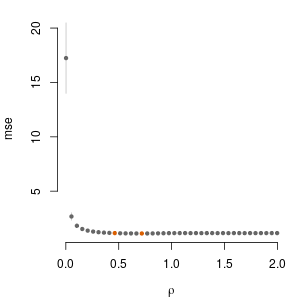

<!-- README.md is generated from README.Rmd. Please edit that file -->

# geneJAM

<!-- badges: start -->
<!-- badges: end -->

The goal of geneJAM is to help clustering outcome components (traits)
that share some feature (genetic component) using polygenic risk scores
(PRS).

## Installation

You can install the development version from
[GitHub](https://github.com/) with:

``` r
# install.packages("devtools")
devtools::install_github("abuchardt/geneJAM")
```

## Example

This is a basic example on simulated data:

``` r
library(geneJAM)
N <- 1000 #
q <- 10 #
p <- 5000 #
set.seed(1)
# Sample 1
X0 <- matrix(rbinom(n = N*p, size = 2, prob = 0.3), nrow=N, ncol=p)
B <- matrix(0, nrow = p, ncol = q)
B[1, 1:2] <- 1
B[3, 3] <- 2
Y0 <- X0 %*% B + matrix(rnorm(N*q), nrow = N, ncol = q)
```

Compute polygenic scores and coefficients

``` r
psobj <- ps.geneJAM(X0, Y0)
ps <- psobj$PS
beta <- psobj$beta
```

Create new sample

``` r
X <- matrix(rbinom(n = N*p, size = 2, prob = 0.3), nrow=N, ncol=p)
Y <- X %*% B + matrix(rnorm(N*q), nrow = N, ncol = q)
PS <- X %*% beta
```

Run geneJAM

``` r
fit <- geneJAM(PS, Y)
```

Plot mean standard error curve

``` r
plot(fit, 1)
```



Plot estimated optimal adjacency matrix

``` r
plot(fit, 2)
```


