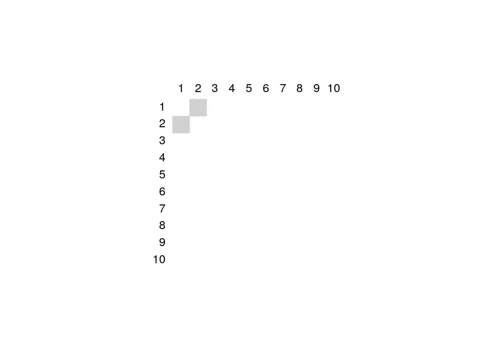

<!-- README.md is generated from README.Rmd. Please edit that file -->
EdGwas
======

<!-- badges: start -->
<!-- badges: end -->
The goal of EdGwas is to help clustering outcome components (traits) that share some feature (genetic component) using polygenic risk scores (PRS).

Installation
------------

You can install the development version from [GitHub](https://github.com/) with:

``` r
# install.packages("devtools")
devtools::install_github("abuchardt/EdGwas")
```

Example
-------

This is a basic example on simulated data:

``` r
library(EdGwas)
# Gaussian
N <- 100 #
q <- 9
p <- 1000 #
set.seed(1)
X <- matrix(sample(0:2, N*p, replace=TRUE), nrow=N, ncol=p)
B <- matrix(0, nrow = p, ncol = q)
B[1:2, 1:5] <- 1
Y <- X %*% B + matrix(rnorm(N*q), nrow = N, ncol = q)
```

Run 5-fold cross-validation for edgwas

``` r
cvfit <- cv.edgwas(x = X, y = Y, nfolds = 5)
```

``` r
plot(cvfit, which = 1)
```


``` r
plot(cvfit, which = 3) 
```


